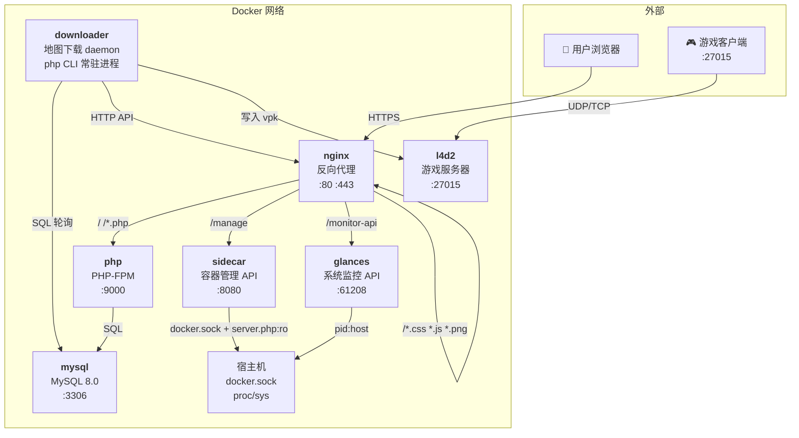
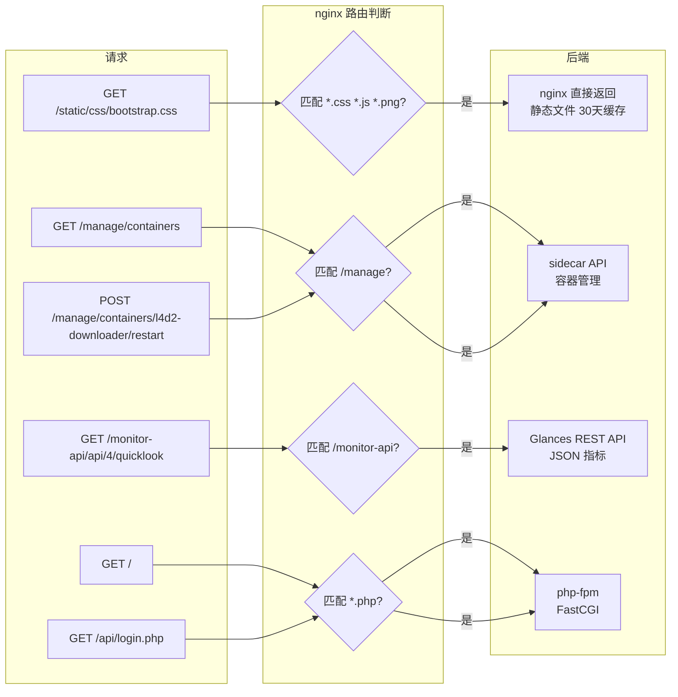
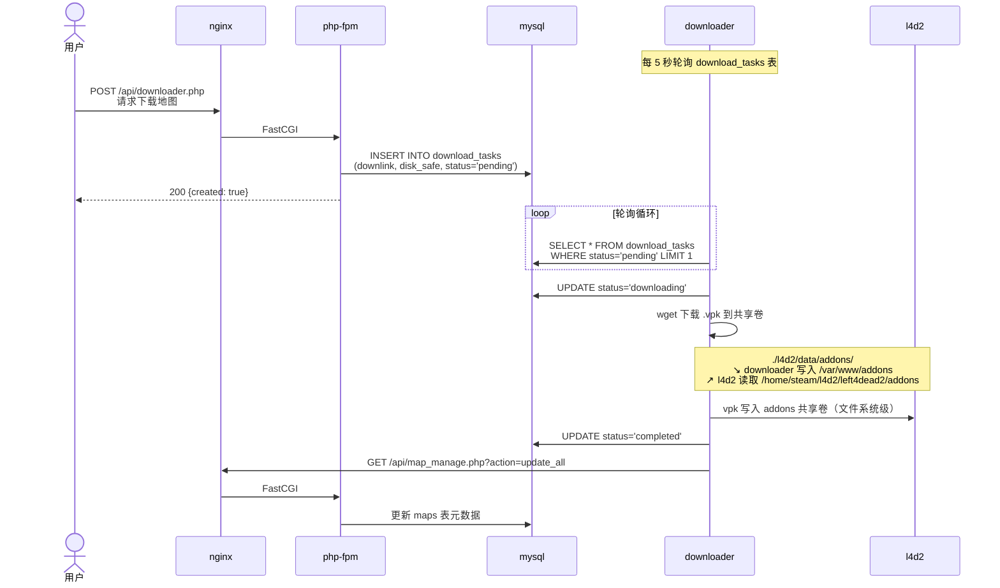
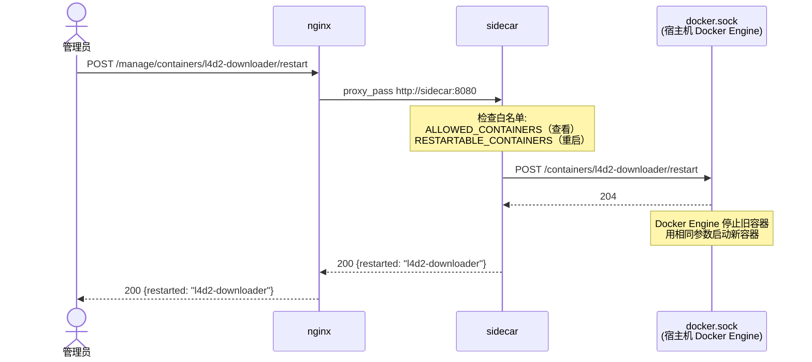
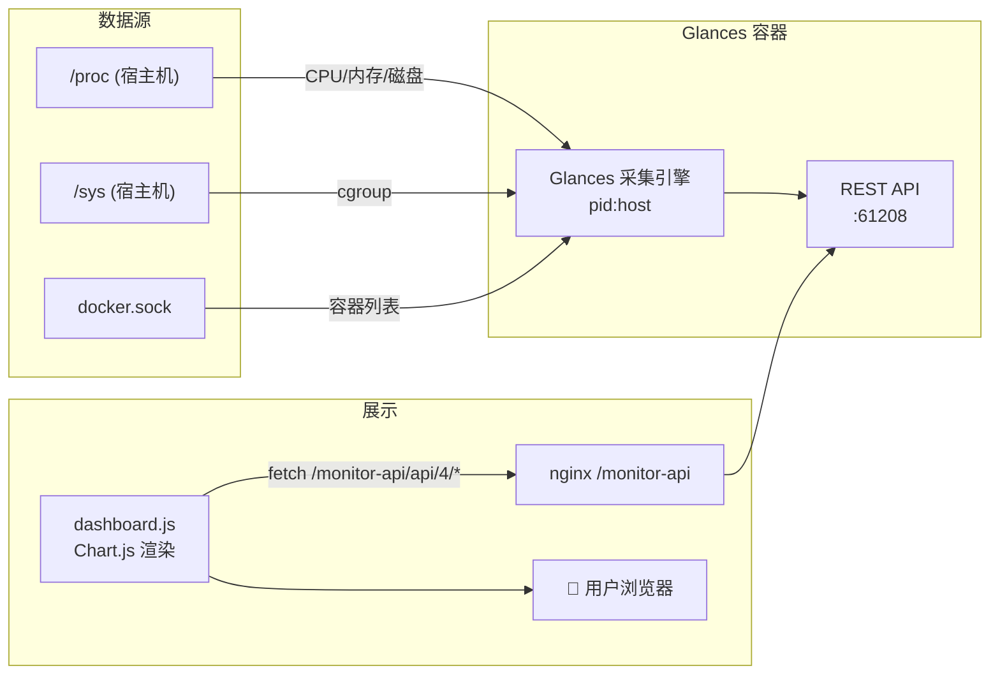
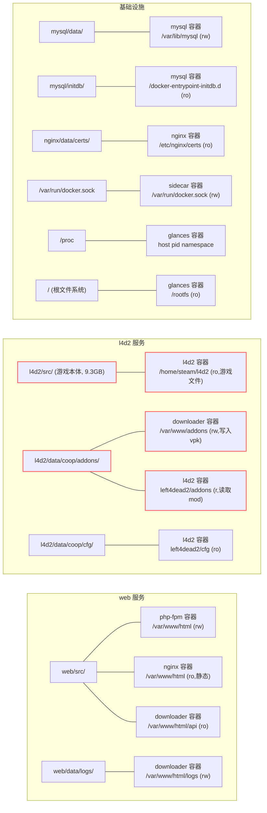
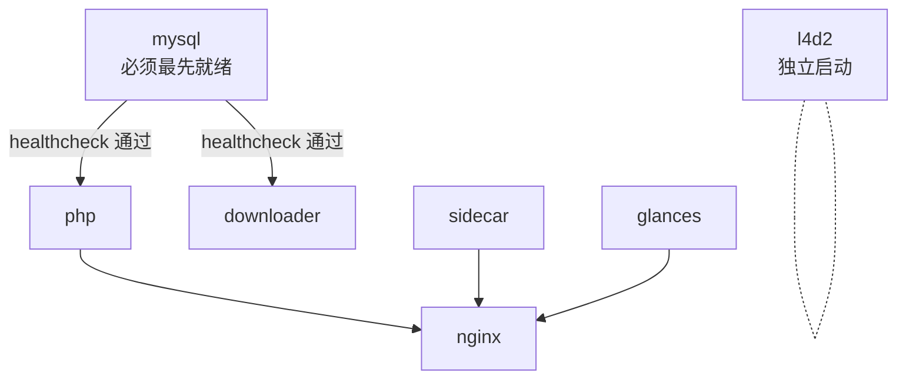

# L4D2 服务器管理平台

基于 Docker 的 Left 4 Dead 2 游戏服务器 + Web 管理面板 + 地图自动下载 + 系统监控。

**技术栈**：Docker Compose / nginx 反向代理 / PHP-FPM / MySQL 8.0 / Glances

---

## 架构

### 容器拓扑



### 请求路由



### 地图下载全链路

这是系统最核心的业务流程——用户在网页上请求下载一个 Workshop 地图，最终出现在游戏服务器中。



### 容器管理链路

用户点击"重启下载器"按钮后发生了什么：



### 监控数据流



> Glances 仅暴露 REST API（`--disable-webui`），前端通过 Chart.js 渲染折线图，X 轴时间 + Y 轴数值 + 悬浮 tooltip，资源占用 ~50MB（Netdata 的 1/5）。

### 目录挂载拓扑

哪些目录在宿主机和容器之间共享：



> 🔴 红色标注：`addons` 目录同时挂载到 downloader（写入 vpk）和 l4d2（读取 vpk）；`GAME_DIR` 从宿主机 bind mount 游戏文件到 l4d2 容器，两者均在镜像外管理。

### 容器依赖关系



**启动顺序**：`mysql` → `php` + `downloader` → `nginx` + `sidecar` + `glances`。`l4d2` 独立启动不依赖其他服务。

---

## 容器清单

| 容器 | 基础镜像 | 作用 | 端口 |
|------|----------|------|------|
| **nginx** | `nginx:alpine` | 反向代理 + 静态文件 + HTTPS | 80, 443 |
| **php** | `php:8.2-fpm-alpine` | PHP 应用后端 | 9000 (内部) |
| **mysql** | `mysql:8.0` | 数据库 | 3306 (内部) |
| **downloader** | `php:8.2-cli-alpine` | 地图下载守护进程 | — |
| **sidecar** | `php:8.2-cli-alpine` | 容器管理 API（挂载 docker.sock） | 8080 (内部) |
| **glances** | `nicolargo/glances` | 宿主机监控 REST API（pid:host） | 61208 (内部) |
| **l4d2** | `ubuntu:22.04` | L4D2 专用服务器 | 27015/udp+tcp |

---

## L4D2 游戏服务器

### 构建理念：镜像只含依赖，游戏文件外挂

```
┌─────────────────────────────────────────────┐
│               l4d2-server-game 镜像          │
│  ubuntu:22.04 + 32位运行库（~300MB）          │
│                                             │
│  ❌ 不含游戏文件（9.3GB）                      │
│  ✅ 启动时从宿主机 bind mount                  │
└─────────────────────────────────────────────┘
         │                    │
    bind mount           bind mount
    GAME_DIR             l4d2/data/coop/
    (游戏本体, ro)        (mod/配置, rw)
         │                    │
         ▼                    ▼
┌─────────────────────────────────────────────┐
│               l4d2 容器 运行时               │
│                                             │
│  /home/steam/l4d2/        ← 游戏文件 (ro)    │
│  /home/steam/l4d2/left4dead2/addons/ ← mod  │
│  /home/steam/l4d2/left4dead2/cfg/   ← 配置  │
└─────────────────────────────────────────────┘
```

### Dockerfile：构建阶段只装 32 位库

```dockerfile
FROM ubuntu:22.04

# srcds 只需要这几个 32 位库即可运行
RUN dpkg --add-architecture i386 && \
    apt-get update && \
    apt-get install -y \
        ca-certificates wget curl tar bzip2 procps gdb \
        libc6:i386 lib32z1 lib32gcc-s1 \
    && apt-get clean

# entrypoint：运行时按 UID/GID 创建用户、降权启动
COPY entrypoint.sh /entrypoint.sh
ENTRYPOINT ["/entrypoint.sh"]
```

镜像构建产物约 **300MB**（不含游戏文件），可同时跑多个实例（战役服 + 对抗服共享同一镜像）。

### 运行时挂载

启动时容器从宿主机挂入以下内容：

| 挂载路径（容器内） | 宿主机路径 | 权限 | 内容 |
|---|---|---|---|
| `/home/steam/l4d2` | `${GAME_DIR}` 或 `./l4d2/src` | ro | srcds 游戏本体 (bin/, left4dead2/, platform/, linux32/) |
| `left4dead2/addons` | `./l4d2/data/{mode}/addons` | rw | SourceMod 插件 + Workshop 地图 vpk |
| `left4dead2/cfg/server.cfg` | `./l4d2/data/{mode}/cfg/server.cfg` | ro | 服务器主配置 |
| `left4dead2/cfg/sourcemod` | `./l4d2/data/{mode}/cfg/sourcemod` | ro | SourceMod 插件配置 |
| `left4dead2/ems` | `./l4d2/data/{mode}/ems` | rw | EMS 脚本数据 |
| `left4dead2/scripts/vscripts` | `./l4d2/data/{mode}/scripts/vscripts` | ro | VScript 脚本 |
| `left4dead2/host.txt` | `./l4d2/data/{mode}/host.txt` | ro | 服务器名 |

### entrypoint.sh 启动流程

```
1. 按 $UID:$GID 创建 steam 用户（若不存在）
2. 创建 ~/.steam/sdk32/steamclient.so 软链接
3. setpriv 降权执行 srcds_run
```

```bash
# 软链接 steamclient.so（Source 引擎必须）
mkdir -p /home/steam/.steam/sdk32
ln -sf /home/steam/l4d2/linux32/steamclient.so \
       /home/steam/.steam/sdk32/steamclient.so

# 降权启动
exec setpriv --reuid=$STEAM_UID --regid=$STEAM_GID --init-groups \
    ./srcds_run ${L4D2_EXTRA_ARGS}
```

> **关键**：UID/GID 必须与宿主机游戏文件 owner 一致，否则 SourceMod 日志写入 Permission denied。通过 `docker-compose.yml` 的 `UID`/`GID` build arg 和环境变量控制。

### addons 目录结构（以 coop 为例）

```
l4d2/data/coop/addons/
├── metamod.vdf              # MetaMod:Source 加载声明
├── metamod/                 # MetaMod:Source 核心
├── sourcemod/               # SourceMod 本体
│   ├── bin/                 # SM 二进制
│   ├── configs/             # 插件配置文件
│   ├── data/                # 运行时数据（数据库、缓存）
│   ├── extensions/          # 扩展（left4dhooks 等）
│   ├── gamedata/            # 游戏数据偏移
│   ├── logs/                # 日志输出 ⚠️ 需要 steam 用户写权限
│   ├── plugins/             # .smx 插件文件
│   └── scripting/           # .sp 源码（编译用）
├── l4dtoolz/                # 人数上限解锁
├── tickrate_enabler.so      # Tickrate 100 解锁
└── *.vpk                    # Workshop 地图文件
```

### 双实例：战役服 + 对抗服

同一镜像 `l4d2-server-game`，通过不同的挂载目录和环境变量区分：

```
docker-compose.yml:

  l4d2:          (coop)          l4d2-versus:    (对抗)
    image: l4d2-server-game        image: l4d2-server-game  ← 复用
    volumes:                        volumes:
      ...data/coop/addons            ...data/versus/addons   ← 不同 mod
      ...data/coop/cfg               ...data/versus/cfg      ← 不同配置
    ports:                          ports:
      27015:27015                   27014:27015              ← 不同端口
```

```bash
docker compose up -d l4d2 l4d2-versus
```

---

## 快速开始

### 开发环境

```bash
# 1. 克隆仓库
git clone <repo-url> l4d2-server && cd l4d2-server

# 2. 配置环境变量
cp .env.example .env
vim .env   # 填写 MySQL 密码、UID/GID、腾讯云 API 密钥

# 3. 下载游戏文件（~9GB，仅首次）
./l4d2.sh install

# 4. 构建基础镜像（含 gd/mysqli/pdo 编译，仅首次 ~500s）
docker build -t l4d2-base-php-fpm:latest -f base-php/Dockerfile.fpm base-php/
docker build -t l4d2-base-php-cli:latest -f base-php/Dockerfile.cli base-php/

# 5. 构建服务镜像并启动
docker compose build
docker compose up -d

# 6. 验证
curl http://localhost/
curl http://localhost/manage/containers
curl http://localhost/monitor-api/api/4/quicklook
```

### 生产环境（从华为云 SWR 拉取预构建镜像）

```bash
# 1. 克隆仓库
git clone <repo-url> l4d2-server && cd l4d2-server

# 2. 使用生产环境配置
cp .env.prod .env
vim .env   # 填入实际密码

# 3. 下载游戏文件
./l4d2.sh install

# 4. 登录 SWR 并拉取镜像（不本地构建）
docker login swr.cn-east-3.myhuaweicloud.com
docker compose pull

# 5. 启动
docker compose up -d
```

### 推送镜像到华为云 SWR

```bash
# 在 .env 中配置 SWR 凭据后：
./docker.sh latest
```

脚本会自动构建基础镜像 + 服务镜像、打标签、推送到 SWR。本地没有 Docker 时会自动安装（Ubuntu/Debian）。

### SWR 镜像可见性

推送到华为云 SWR 的镜像默认为 **私有（private）**，仅组织 `tunarund` 内授权用户可拉取。

| 场景 | 方案 |
|------|------|
| **生产服务器** | 用 `docker login` 登录 SWR 后即可 `docker compose pull` |
| **团队协作** | SWR 控制台 → 组织管理 → 添加成员，分配权限 |
| **公开分享** | SWR 控制台 → 我的镜像 → 仓库 → 权限 → 设为**公开** |

> 设为公开后，任何人无需登录即可拉取：`docker pull swr.cn-east-3.myhuaweicloud.com/tunarund/l4d2-server-game:latest`

---

## 路由设计

| 路径 | 后端 | 说明 |
|------|------|------|
| `/` | php-fpm | Web 管理面板（仪表盘、地图、个人中心） |
| `/api/*` | php-fpm | REST API 端点 |
| `*.css/js/png/...` | nginx 直接返回 | 静态资源 30 天缓存 |
| `/manage/` | sidecar | 容器管理（列表、重启，需认证） |
| `/monitor-api/` | glances | 系统监控 REST API（CPU/内存/磁盘/网络 JSON） |

---

## Sidecar API

容器管理接口，挂载 `docker.sock` + `server.php`（运行时挂载，改完即生效），双重白名单 + Token 认证。

```bash
# 健康检查（无需认证）
GET /manage/health
→ {"status": "ok"}

# 列出运行中的容器（需认证）
GET /manage/containers
→ {
    "containers": [...],
    "viewable":    ["l4d2-nginx","l4d2-php",...],   # ALLOWED_CONTAINERS
    "restartable": ["l4d2-downloader","l4d2-coop",...]  # RESTARTABLE_CONTAINERS
  }

# 重启指定容器（需认证 + 在 restartable 列表内）
POST /manage/containers/l4d2-downloader/restart
Header: X-Auth-Token: {SIDECAR_TOKEN}
→ {"restarted": "l4d2-downloader", "message": "ok"}
```

**白名单**：

| 变量 | 默认值 | 作用 |
|------|--------|------|
| `ALLOWED_CONTAINERS` | `l4d2-downloader,l4d2-coop,...` | 允许在面板查看的容器 |
| `RESTARTABLE_CONTAINERS` | `l4d2-downloader,l4d2-coop,l4d2-versus` | 允许重启的容器（应为 ALLOWED 子集） |
| `SIDECAR_TOKEN` | （空 = 跳过认证） | API 认证令牌 |

> `server.php` 通过 volume mount 挂载（`./sidecar/server.php:/server.php:ro`），修改后 `docker compose restart sidecar` 即可，无需 rebuild。

---

## 环境变量

### 运行变量

| 变量 | 服务 | 说明 |
|------|------|------|
| `MYSQL_ROOT_PASSWORD` | mysql | root 密码 |
| `MYSQL_DATABASE` | mysql, php, downloader | 数据库名 |
| `MYSQL_USER` / `MYSQL_PASSWORD` | mysql, php, downloader | 应用数据库账号 |
| `UID` / `GID` | php, downloader, l4d2 | 容器运行用户（**必须与游戏文件 owner 一致**） |
| `GAME_DIR` | l4d2 | 游戏文件目录（默认 `./l4d2/src`） |
| `TENCENTCLOUD_SECRET_ID` | php | 腾讯云 SES 邮件服务 |
| `TENCENTCLOUD_SECRET_KEY` | php | 腾讯云 SES 邮件服务 |
| `WEB_HOST` | downloader | Web API 主机名（默认 `nginx`） |
| `MAP_DIR` | downloader | 地图下载目录 |
| `LOG_DIR` | downloader | 日志目录 |
| `L4D2_COOP_ARGS` | l4d2 | 战役服 srcds 启动参数 |
| `L4D2_VERSUS_ARGS` | l4d2-versus | 对抗服 srcds 启动参数 |
| `ALLOWED_CONTAINERS` | sidecar | 允许查看的容器列表 |
| `RESTARTABLE_CONTAINERS` | sidecar | 允许重启的容器列表（ALLOWED 子集） |
| `SIDECAR_TOKEN` | php, sidecar | sidecar API 认证令牌（空 = 跳过认证） |

### 镜像仓库变量

| 变量 | 说明 |
|------|------|
| `REGISTRY` | 镜像仓库前缀。**开发环境留空**（本地构建），**生产环境**设为 `swr.<region>.myhuaweicloud.com/<org>/` |
| `SWR_USER` | 华为云 SWR 登录用户名，格式 `<region>@<AK>`（仅 `docker.sh` 推送时使用） |
| `SWR_PASSWORD` | 华为云 SWR 长期有效登录密码（仅 `docker.sh` 推送时使用） |

> **原理**：`docker-compose.yml` 中所有自定义镜像使用 `${REGISTRY}<name>:latest`。`REGISTRY` 为空时 `docker compose build` 本地构建；设为 SWR 路径后 `docker compose pull` 从华为云拉取。同一份 compose 文件适配两种环境。

---

## 镜像大小

| 服务 | 大小 | 备注 |
|------|------|------|
| nginx | ~62MB | Alpine 基础 |
| php | ~100MB | Alpine 基础，含 gd/mysqli/pdo |
| mysql | ~799MB | 官方镜像 |
| downloader | ~100MB | Alpine 基础，含 pcntl |
| sidecar | ~150MB | Alpine + docker-cli |
| glances | ~124MB | 官方镜像 |
| l4d2 | **~335MB** | 仅 32 位库，游戏文件 (9.3GB) 运行时 bind mount |

> 注：l4d2 镜像不含游戏资产。镜像大小仅为基础系统 + 32 位依赖。9.3GB 的 srcds 文件通过 `${GAME_DIR}` 在运行时挂载。

---

## 项目目录结构

```
l4d2-server/
├── docker-compose.yml          # 服务编排
├── .env.example                # 环境变量模板（开发）
├── .env.prod                   # 环境变量模板（生产，REGISTRY 指向 SWR）
├── .dockerignore               # l4d2 构建排除（跳过 l4d2/src/）
├── docker.sh                   # 构建 & 推送到华为云 SWR（自动安装 Docker）
├── l4d2.sh                     # 游戏文件管理（steamcmd 下载/更新）
├── healthcheck.sh              # 18 项健康检查
│
├── nginx/                      # 反向代理
│   ├── Dockerfile              # nginx:alpine
│   └── data/                   # 运行时挂载
│       ├── nginx.conf          # 主配置（gzip, worker, ...）
│       ├── conf.d/
│       │   └── l4d2.conf       # 路由规则（/ /manage /monitor-api）
│       └── certs/              # SSL 证书
│
├── base-php/                   # PHP 基础镜像（预编译扩展，避免重复编译）
│   ├── Dockerfile.fpm          # l4d2-base-php-fpm（php-fpm 用）
│   └── Dockerfile.cli          # l4d2-base-php-cli（downloader + sidecar 用）
│
├── web/                        # PHP 应用
│   ├── Dockerfile              # FROM l4d2-base-php-fpm
│   ├── src/                    # PHP 源码
│   │   ├── index.php
│   │   ├── dashboard.php       # 监控中心（下载任务 + 系统资源仪表盘）
│   │   ├── navbar.php          # 导航栏 + 公共 header
│   │   ├── api/                # API 端点 (tools, login, downloader, ...)
│   │   └── static/
│   │       ├── css/            # Bootstrap 样式
│   │       ├── js/
│   │       │   └── custom/     # 自定义 JS（dashboard, navbar, ...）
│   │       └── font/           # 图标字体
│   └── data/logs/              # 运行时日志（挂载目录）
│
├── downloader/                 # 地图下载器
│   ├── Dockerfile              # FROM l4d2-base-php-cli + shadow/util-linux
│   └── entrypoint.sh           # 按 UID/GID 创建用户后启动 daemon
│
├── sidecar/                    # 容器管理 API
│   ├── Dockerfile              # FROM l4d2-base-php-cli + docker-cli
│   └── server.php              # 路由逻辑（运行时挂载，改完 restart 即生效）
│
├── l4d2/                       # 游戏服务器
│   ├── Dockerfile              # ubuntu:22.04 + 32位库（仅 ~300MB）
│   ├── entrypoint.sh           # 创建用户 → 链接 steamclient.so → 降权启动 srcds
│   ├── src/                    # srcds 游戏文件（bind mount，不进 Git/不进镜像）
│   └── data/
│       ├── coop/               # 战役服
│       │   ├── cfg/            #   server.cfg, sourcemod 配置
│       │   ├── addons/         #   SourceMod + Workshop 地图
│       │   ├── ems/            #   EMS 脚本数据
│       │   ├── scripts/        #   VScript
│       │   ├── host.txt        #   服务器名
│       │   └── motd.txt        #   欢迎消息
│       └── versus/             # 对抗服（与 coop 结构相同，独立配置和插件）
│
├── mysql/
│   ├── data/                   # MySQL 数据持久化
│   └── initdb/
│       └── 01-steam.sql        # 数据库初始化（users, maps, download_tasks 表）
│
└── .env                        # 环境变量（Git 忽略）
```

---

## 决策记录

| # | 决策项 | 结论 | 理由 |
|---|--------|------|------|
| 1 | 反向代理 | **nginx 独立容器** | 统一入口路由 `/` `/manage` `/monitor-api` |
| 2 | Web 技术栈 | **nginx + php-fpm 分离** | 原生 PHP 最小改动，php-fpm 专注业务 |
| 3 | 容器管理 | **sidecar + docker.sock** | PHP 内置服务器 + Docker CLI，白名单控制 |
| 4 | 监控方案 | **Glances（API only）** | 比 Netdata 轻 5 倍（~50MB vs ~250MB），仅 REST API，前端 Chart.js 渲染 |
| 5 | Git 仓库 | **Monorepo** | 单人开发，7 个服务共享配置 |
| 6 | L4D2 基础镜像 | **ubuntu:22.04** | srcds 只需 32 位库即可运行，镜像仅 ~300MB |
| 7 | L4D2 游戏文件 | **运行时 bind mount** | 不进 Git、不进镜像，宿主机构建后挂载，镜像可复用 |
| 8 | L4D2 双实例 | **复用同一镜像** | 战役服和对抗服使用同一 `l4d2-server-game` 镜像，挂载不同配置/addons |
| 9 | Downloader | **独立容器** | Web 和下载逻辑解耦，互不影响 |
| 10 | 数据库 | **MySQL 8.0 + initdb 自动导入** | 1.9MB SQL 首次启动自动恢复 |
| 11 | PHP 配置 | **全部从环境变量读取** | `getenv()` + fallback，不改代码只改 env |
| 12 | Sidecar 部署 | **server.php 运行时挂载** | 改完 restart 即生效，无需 rebuild |
| 13 | 容器管理权限 | **查看/重启分离** | `ALLOWED_CONTAINERS` 控制可见性，`RESTARTABLE_CONTAINERS` 控制可重启 |
| 14 | JS 工具函数 | **tools.js 统一管理** | `formatBytes/formatBits/escHtml` 等基础函数集中在 tools.js，各页面 import 使用 |
| 15 | PHP 基础镜像 | **Alpine 替代 Debian** | `php:8.2-fpm-alpine` / `php:8.2-cli-alpine`，节省约 1.4GB，镜像从 500MB+ 降到 100MB |
| 16 | 游戏资产获取 | **steamcmd 命令行下载** | `./l4d2.sh install` 匿名下载 9.3GB 游戏文件，不进 Git、不进镜像 |
| 17 | 镜像分发 | **华为云 SWR** | 通过 `${REGISTRY}` 变量开发/生产环境共用同一份 docker-compose.yml，`./docker.sh` 一键推送 |
| 18 | 登录凭据管理 | **.env 中仅 3 个 SWR 变量** | `REGISTRY`（镜像前缀）、`SWR_USER`（`region@AK`）、`SWR_PASSWORD`，脚本按需提取 |

---

## 已知问题

| 问题 | 影响 | 说明 |
|------|------|------|
| UID/GID 不匹配 | SourceMod 日志 Permission denied | 确保 `UID`/`GID` 与 `l4d2/src/` owner 一致 |
| srcds root 启动警告 | 启动延迟 10s | entrypoint 已通过 setpriv 降权 |
| Glances 磁盘挂载点 | fs 插件可能显示容器 overlay | 已挂载 `/:/rootfs:ro` |
| Firefox HTTPS-Only | 本地 IP 访问自动跳转 HTTPS | `about:preferences#privacy` 关闭或添加例外 |
| Alpine 无 bash | downloader entrypoint 需 `#!/bin/sh` | 已适配，`getent` → `grep`, `useradd` → `adduser` |
| steamcmd 下载慢 | 首次下载约 9.3GB | 可在网络好的机器下载后 scp/rsync 到服务器 |
