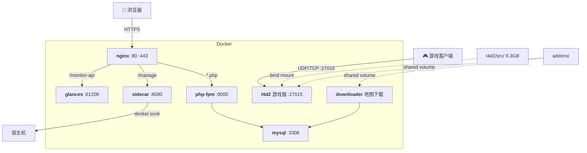

# L4D2 服务器管理平台

基于 Docker 的 Left 4 Dead 2 游戏服务器 + Web 管理面板 + 地图自动下载 + 系统监控。

**技术栈**：Docker Compose / nginx / PHP-FPM / MySQL 8.0 / Glances

---

## 快速开始

```bash
git clone --depth=1 https://github.com/TunArund/L4D2-ServerPack.git && cd L4D2-ServerPack
cp .env.example .env            # 填入密码 + SIDECAR_TOKEN
./l4d2.sh install               # steamcmd 下载游戏 (~9GB)
./docker.sh install             # 自动安装 Docker (已装则跳过)
```

**本地构建 & 启动**（`./docker.sh install` 已自动配置 Docker Hub 加速）：
```bash
./docker.sh build
./docker.sh up
```

**拉取预构建镜像**（适合国外 VPS）：
```bash
# .env 中 REGISTRY=ghcr.io/tunarund/
./docker.sh pull
./docker.sh up
```

**推送镜像**（`.env` 中填入 `GITHUB_USER` / `GITHUB_TOKEN`）：
```bash
./docker.sh push latest
```
> Token：[GitHub Settings → Tokens (classic)](https://github.com/settings/tokens) → `write:packages`。首次推送后在 Package Settings 中设为 Public。

---

## 架构



**启动顺序**：`mysql` → `php` + `downloader` → `nginx` + `sidecar` + `glances`。`l4d2` 独立启动。

核心设计：
- **请求路由**：nginx 根据路径将请求分发到 php-fpm (`/`, `/api/*`)、sidecar (`/manage`)、glances (`/monitor-api`)，静态资源直接返回。
- **地图下载**：用户通过 Web 面板提交下载请求 → php 写入 `download_tasks` 表 → `task_daemon` 每 5 秒轮询 → curl 从 Steam CDN 下载 vpk 到 addons 共享卷 → l4d2 直接读取。
- **COS 分发**：每日凌晨 3 点通过 API 触发 `cos_batch_upload` 上传 active 地图到腾讯 COS → `cos_sync_index` 更新目录浏览页 `index.html` → `cos_cleanup_orphans` 清理已删地图的残留文件。管理员也可在面板手动触发。
- **静态网站**：COS 桶开启静态网站托管 + 自定义域名 `map.tunarund.top`，`index.html` 通过 JS 动态调用 ListBucket API 实现目录浏览，无需 PHP 中转。
- **日志轮转**：`add_log()` 内置按日轮转，目录结构 `{应用名}/YYYY/MM/DD.log`，零外部依赖。
- **测试体系**：`./test.sh` 统一测试入口 — `./test.sh all` 自动化 + 人工引导全覆盖，`./test.sh healthcheck` 快速探活。
- **容器管理**：sidecar 挂载 `docker.sock`，通过白名单控制可查看/可重启的容器，Token 认证。
- **监控**：Glances 仅暴露 REST API（`--disable-webui`），前端 Chart.js 渲染，资源占用 ~50MB。

---

## 容器清单

| 容器 | 基础镜像 | 大小 | 作用 | 端口 |
|------|----------|------|------|------|
| **nginx** | `nginx:alpine` | ~62MB | 反向代理 + 静态文件 | 80, 443 |
| **php** | `php:8.3-fpm-alpine` | ~100MB | PHP 应用后端 | 9000 |
| **mysql** | `mysql:8.0` | ~799MB | 数据库 | 3306 |
| **downloader** | `php:8.3-cli-alpine` | ~100MB | `task_daemon` 地图下载 + 每日维护编排 | — |
| **sidecar** | `php:8.3-cli-alpine` | ~150MB | 容器管理（挂载 docker.sock） | 8080 |
| **glances** | `nicolargo/glances` | ~124MB | 系统监控 REST API（pid:host） | 61208 |
| **l4d2** | `ubuntu:22.04` | ~335MB | 游戏服务器 | 27015/udp+tcp |

> l4d2 镜像仅含 32 位运行库，9.3GB 游戏文件通过 `${GAME_DIR}` bind mount，不进镜像。PHP 服务共用 `base-php` 预编译基础镜像（Alpine + gd/mysqli/pdo），避免重复编译。

---

## L4D2 游戏服务器

镜像只含运行环境，游戏文件通过 `./l4d2.sh install`（steamcmd 匿名下载）放到 `l4d2/src/`，运行时 bind mount 进容器。镜像可被战役服和对抗服两个实例复用：

```yaml
# docker-compose.yml
l4d2:             # 战役服               l4d2-versus:      # 对抗服
  image: l4d2-server-game                image: l4d2-server-game  ← 同一镜像
  volumes:                                volumes:
    - ...data/coop/addons                   - ...data/versus/addons
    - ...data/coop/cfg                      - ...data/versus/cfg
  ports:                                   ports:
    - 27015:27015                           - 27014:27015
```

### 挂载策略

两个容器共享同一份游戏本体 `${GAME_DIR}`（只读使用），但通过 **按路径覆盖挂载** 实现配置隔离：

```
${GAME_DIR:-./l4d2/src}          ← 游戏本体（共享，两个容器只读使用）
  ├── left4dead2/addons/          ← 被 coop 或 versus 的 addons 覆盖
  ├── left4dead2/cfg/             ← 部分子路径被覆盖，其余共享
  └── ...

l4d2/data/coop/                   ← 战役服专用数据（不进 Git）
  ├── addons/  → 覆盖 addons/
  ├── cfg/     → 覆盖 cfg/server.cfg, cfg/sourcemod/, cfg/cfgogl/ ...
  └── ...

l4d2/data/versus/                 ← 对抗服专用数据（不进 Git）
  ├── addons/  → 覆盖 addons/
  ├── cfg/     → 覆盖 cfg/server.cfg, cfg/stripper/, cfg/cvar_tracking.cfg ...
  └── ...
```

> **为什么不冲突？** 两个容器是独立实例，各自把不同宿主机路径挂载到各自容器内的相同位置，互不干扰。共享 `${GAME_DIR}` 中的默认文件（如 maps、materials）两个容器只读访问，写操作（日志、cvar_tracking）通过覆盖挂载隔离到各自目录。

### 数据目录与 Git 忽略策略

`l4d2/data/{coop,versus}/` 下的内容分为两类：

| 目录/文件 | Git | 原因 |
|-----------|-----|------|
| `addons/*` | **忽略**（仅保留 `.gitkeep`） | 二进制插件/第三方 vpk，不进仓库，本地维护 |
| `ems/*` | **忽略**（仅保留 `.gitkeep`） | 运行时数据 |
| `cfg/*` | **忽略**（仅保留 `.gitkeep`） | 配置文件含服务器特定设置，通过 `.env` 管理差异 |
| `scripts/*` | **忽略**（仅保留 `.gitkeep`） | vscripts 脚本，随 addons 分发 |
| `host.txt` / `motd.txt` | **忽略** | 服务器身份信息，环境相关 |

> `.gitkeep` 文件保留目录结构在 Git 中可见，实际内容通过 scp/rsync 同步到服务器。插件目录（metamod、sourcemod、stripper 等）及其配置都放在 addons/ 和 cfg/ 下随 `.gitkeep` 一起手动管理。

> UID/GID 必须与 `l4d2/src/` owner 一致，否则 SourceMod 日志写入 Permission denied。

---

## 路由设计

| 路径 | 后端 | 说明 |
|------|------|------|
| `/` `/api/*` | php-fpm | Web 管理面板 + REST API |
| `*.css/js/png/...` | nginx | 静态资源 30 天缓存 |
| `/manage/*` | sidecar | 容器管理 API（需 Token） |
| `/monitor-api/*` | glances | 系统监控 JSON |

---

## Sidecar API

| 端点 | 认证 | 说明 |
|------|------|------|
| `GET /manage/health` | — | 健康检查 |
| `GET /manage/containers` | Token | 列出容器（`ALLOWED_CONTAINERS` 白名单） |
| `POST /manage/containers/{name}/restart` | Token | 重启容器（需在 `RESTARTABLE_CONTAINERS` 内） |

> `server.php` 运行时挂载，改完 `docker compose restart sidecar` 即生效。

---

## 环境变量

| 变量 | 服务 | 说明 |
|------|------|------|
| `REGISTRY` | 全部 | 镜像前缀。开发留空，生产设 `ghcr.io/<user>/` |
| `MYSQL_ROOT_PASSWORD` | mysql | root 密码 |
| `MYSQL_DATABASE` / `MYSQL_USER` / `MYSQL_PASSWORD` | mysql, php, dl | 数据库 |
| `APP_UID` / `APP_GID` | php, dl, l4d2 | **必须与游戏文件 owner 一致** |
| `GAME_DIR` | l4d2 | 游戏文件目录（默认 `./l4d2/src`） |
| `SIDECAR_TOKEN` | php, sidecar, downloader | API 令牌（空 = 跳过认证）；downloader 用于 `call_api()` 每日维护内部调用 |
| `ALLOWED_CONTAINERS` / `RESTARTABLE_CONTAINERS` | sidecar | 容器管理白名单 |
| `L4D2_COOP_ARGS` / `L4D2_VERSUS_ARGS` | l4d2 | srcds 启动参数 |
| `SES_SECRET_ID` / `SES_SECRET_KEY` | php | 腾讯云 SES 邮件 |
| `COS_SECRET_ID` / `COS_SECRET_KEY` | php | 腾讯云 COS API 密钥 |
| `COS_BUCKET` | php | COS 存储桶名称（含 APPID） |
| `COS_REGION` | php | 存储桶地域，默认 `ap-guangzhou` |
| `COS_CUSTOM_DOMAIN` | php | 可选：CDN 加速域名，设置后 COS 公网 URL 使用该域名 |
| `GITHUB_USER` / `GITHUB_TOKEN` | docker.sh | ghcr.io 推送凭据 |

---

## 目录结构

```
l4d2-server/
├── docker-compose.yml
├── .env.example
├── docker.sh                   # Docker 管理 (install/build/up/down/push/logs…)
├── l4d2.sh                     # steamcmd 下载/更新游戏
├── test.sh                     # 测试入口 (healthcheck + auto + manual)
├── CHANGELOG.md                 # 更新日志
│
├── base-php/                   # PHP 基础镜像（预编译 gd/mysqli/pdo/pcntl）
├── web/                        # PHP 应用 (FROM base-php-fpm)
├── downloader/                 # 地图下载器 (FROM base-php-cli)
├── sidecar/                    # 容器管理 API (FROM base-php-cli + docker-cli)
├── nginx/                      # 反向代理 (nginx:alpine)
├── l4d2/                       # 游戏服务器 (ubuntu:22.04)
│   ├── src/                    # 游戏文件 (bind mount, 不进 Git)
│   └── data/{coop,versus}/     # 配置/addons (按模式分离)
├── mysql/
│   ├── data/                   # 数据持久化
│   └── initdb/                 # 初始化 SQL
├── test/
│   ├── script/                  # 测试脚本 (healthcheck + auto_* + manual_web)
│   └── log/                     # 测试日志 (Git 忽略)
└── .env                        # (Git 忽略)
```

---
## SSL证书快速配置

### 阿里云 DNS（推荐）

```bash
# ① 安装 acme.sh
curl https://get.acme.sh | sh && source ~/.bashrc

# ② 获取 AccessKey（https://ram.console.aliyun.com/users → 子用户 → OpenAPI访问）
export Ali_Key="LTAI5t..."
export Ali_Secret="..."

# ③ 申请证书（Let's Encrypt, 自动 DNS TXT 验证）
acme.sh --set-default-ca --server letsencrypt
acme.sh --issue --dns dns_ali -d l4d2.tunarund.top

# ④ 安装到 nginx certs 目录，证书更新后自动 reload
acme.sh --install-cert -d l4d2.tunarund.top \
  --key-file       /home/steam/L4D2-ServerPack/nginx/data/certs/privkey.pem \
  --fullchain-file /home/steam/L4D2-ServerPack/nginx/data/certs/fullchain.pem \
  --reloadcmd      "docker exec l4d2-nginx nginx -s reload"
```

### 腾讯云 DNSPod

```bash
# AccessKey → https://console.dnspod.cn/account/token/token
export DP_Id="你的DNSPod_ID"
export DP_Key="你的DNSPod_Token"
acme.sh --issue --dns dns_dp -d l4d2.tunarund.top
# install-cert 同上
```
### nginx配置
./nginx/data/conf.d/l4d2.conf

> 证书 90 天有效，acme.sh 自动添加 cron 续期任务，无需手动操作。
## 致谢
https://github.com/KevonLin/l4d2-docker-zonemod
给了steamcmd便捷下载求生之路2服务器文件的指令
## 已知问题

| 问题 | 说明 |
|------|------|
|docker镜像拉取超时|docker hub境内访问受限，解决办法参考https://github.com/dongyubin/DockerHub|
| UID/GID 不匹配 | `UID`/`GID` 需与 `l4d2/src/` owner 一致，否则 SourceMod Permission denied |
| steamcmd 下载慢 | 首次 ~9.3GB，可在网络好的机器下载后 scp 到服务器 |
| 挂载目录删不掉 | 这些目录由容器 UID 写入，宿主用户无权删除。用 Docker 指令操作：`docker compose down -v` 删 volumes，或 `docker run --rm -v $(pwd):/mnt alpine rm -rf /mnt/<目录>` |
