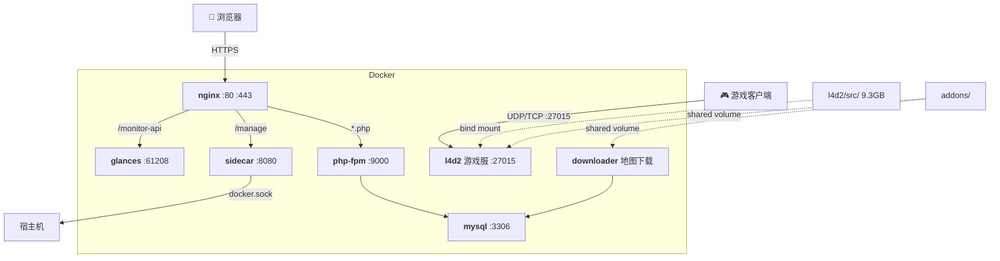

# L4D2 服务器管理平台

基于 Docker 的 Left 4 Dead 2 游戏服务器 + Web 管理面板 + 地图自动下载 + 系统监控。

**技术栈**：Docker Compose / nginx / PHP-FPM / MySQL 8.0 / Glances

---

## 快速开始

```bash
git clone https://github.com/TunArund/L4D2-ServerPack.git l4d2-server && cd l4d2-server
cp .env.example .env            # 填入密码 + SIDECAR_TOKEN
./l4d2.sh install               # steamcmd 下载游戏 (~9GB)
./docker.sh install             # 自动安装 Docker (已装则跳过)
```

**本地构建 & 启动**（`./docker.sh install` 已自动配置 Docker Hub 加速）：
```bash
./docker.sh build
./docker.sh up
```

**拉取预构建镜像**（适合国外 VPS）：
```bash
# .env 中 REGISTRY=ghcr.io/tunarund/
./docker.sh pull
./docker.sh up
```

**推送镜像**（`.env` 中填入 `GITHUB_USER` / `GITHUB_TOKEN`）：
```bash
./docker.sh push latest
```
> Token：[GitHub Settings → Tokens (classic)](https://github.com/settings/tokens) → `write:packages`。首次推送后在 Package Settings 中设为 Public。

---

## 架构



**启动顺序**：`mysql` → `php` + `downloader` → `nginx` + `sidecar` + `glances`。`l4d2` 独立启动。

核心设计：
- **请求路由**：nginx 根据路径将请求分发到 php-fpm (`/`, `/api/*`)、sidecar (`/manage`)、glances (`/monitor-api`)，静态资源直接返回。
- **地图下载**：用户通过 Web 面板提交下载请求 → php 写入 `download_tasks` 表 → downloader 每 5 秒轮询 → wget 下载 vpk 到 addons 共享卷 → l4d2 直接读取。
- **容器管理**：sidecar 挂载 `docker.sock`，通过白名单控制可查看/可重启的容器，Token 认证。
- **监控**：Glances 仅暴露 REST API（`--disable-webui`），前端 Chart.js 渲染，资源占用 ~50MB。

---

## 容器清单

| 容器 | 基础镜像 | 大小 | 作用 | 端口 |
|------|----------|------|------|------|
| **nginx** | `nginx:alpine` | ~62MB | 反向代理 + 静态文件 | 80, 443 |
| **php** | `php:8.3-fpm-alpine` | ~100MB | PHP 应用后端 | 9000 |
| **mysql** | `mysql:8.0` | ~799MB | 数据库 | 3306 |
| **downloader** | `php:8.3-cli-alpine` | ~100MB | 地图下载守护进程 | — |
| **sidecar** | `php:8.3-cli-alpine` | ~150MB | 容器管理（挂载 docker.sock） | 8080 |
| **glances** | `nicolargo/glances` | ~124MB | 系统监控 REST API（pid:host） | 61208 |
| **l4d2** | `ubuntu:22.04` | ~335MB | 游戏服务器 | 27015/udp+tcp |

> l4d2 镜像仅含 32 位运行库，9.3GB 游戏文件通过 `${GAME_DIR}` bind mount，不进镜像。PHP 服务共用 `base-php` 预编译基础镜像（Alpine + gd/mysqli/pdo），避免重复编译。

---

## L4D2 游戏服务器

镜像只含运行环境，游戏文件通过 `./l4d2.sh install`（steamcmd 匿名下载）放到 `l4d2/src/`，运行时 bind mount 进容器。镜像可被战役服和对抗服两个实例复用：

```yaml
# docker-compose.yml
l4d2:             # 战役服               l4d2-versus:      # 对抗服
  image: l4d2-server-game                image: l4d2-server-game  ← 同一镜像
  volumes:                                volumes:
    - ...data/coop/addons                   - ...data/versus/addons
    - ...data/coop/cfg                      - ...data/versus/cfg
  ports:                                   ports:
    - 27015:27015                           - 27014:27015
```

> UID/GID 必须与 `l4d2/src/` owner 一致，否则 SourceMod 日志写入 Permission denied。

---

## 路由设计

| 路径 | 后端 | 说明 |
|------|------|------|
| `/` `/api/*` | php-fpm | Web 管理面板 + REST API |
| `*.css/js/png/...` | nginx | 静态资源 30 天缓存 |
| `/manage/*` | sidecar | 容器管理 API（需 Token） |
| `/monitor-api/*` | glances | 系统监控 JSON |

---

## Sidecar API

| 端点 | 认证 | 说明 |
|------|------|------|
| `GET /manage/health` | — | 健康检查 |
| `GET /manage/containers` | Token | 列出容器（`ALLOWED_CONTAINERS` 白名单） |
| `POST /manage/containers/{name}/restart` | Token | 重启容器（需在 `RESTARTABLE_CONTAINERS` 内） |

> `server.php` 运行时挂载，改完 `docker compose restart sidecar` 即生效。

---

## 环境变量

| 变量 | 服务 | 说明 |
|------|------|------|
| `REGISTRY` | 全部 | 镜像前缀。开发留空，生产设 `ghcr.io/<user>/` |
| `MYSQL_ROOT_PASSWORD` | mysql | root 密码 |
| `MYSQL_DATABASE` / `MYSQL_USER` / `MYSQL_PASSWORD` | mysql, php, dl | 数据库 |
| `UID` / `GID` | php, dl, l4d2 | **必须与游戏文件 owner 一致** |
| `GAME_DIR` | l4d2 | 游戏文件目录（默认 `./l4d2/src`） |
| `SIDECAR_TOKEN` | php, sidecar | API 令牌（空 = 跳过认证） |
| `ALLOWED_CONTAINERS` / `RESTARTABLE_CONTAINERS` | sidecar | 容器管理白名单 |
| `L4D2_COOP_ARGS` / `L4D2_VERSUS_ARGS` | l4d2 | srcds 启动参数 |
| `TENCENTCLOUD_SECRET_ID` / `TENCENTCLOUD_SECRET_KEY` | php | 腾讯云 SES 邮件 |
| `GITHUB_USER` / `GITHUB_TOKEN` | docker.sh | ghcr.io 推送凭据 |

---

## 目录结构

```
l4d2-server/
├── docker-compose.yml
├── .env.example
├── docker.sh                   # Docker 管理 (install/build/up/down/push/logs…)
├── l4d2.sh                     # steamcmd 下载/更新游戏
├── healthcheck.sh
│
├── base-php/                   # PHP 基础镜像（预编译 gd/mysqli/pdo/pcntl）
├── web/                        # PHP 应用 (FROM base-php-fpm)
├── downloader/                 # 地图下载器 (FROM base-php-cli)
├── sidecar/                    # 容器管理 API (FROM base-php-cli + docker-cli)
├── nginx/                      # 反向代理 (nginx:alpine)
├── l4d2/                       # 游戏服务器 (ubuntu:22.04)
│   ├── src/                    # 游戏文件 (bind mount, 不进 Git)
│   └── data/{coop,versus}/     # 配置/addons (按模式分离)
├── mysql/
│   ├── data/                   # 数据持久化
│   └── initdb/                 # 初始化 SQL
└── .env                        # (Git 忽略)
```

---

## 致谢
https://github.com/KevonLin/l4d2-docker-zonemod
给了steamcmd便捷下载求生之路2服务器文件的指令
## 已知问题

| 问题 | 说明 |
|------|------|
| UID/GID 不匹配 | `UID`/`GID` 需与 `l4d2/src/` owner 一致，否则 SourceMod Permission denied |
| steamcmd 下载慢 | 首次 ~9.3GB，可在网络好的机器下载后 scp 到服务器 |
| 挂载目录删不掉 | 容器内写入的文件（如 MySQL 数据）宿主普通用户无权删除，执行 `./docker.sh fix-perms` 修复 |
