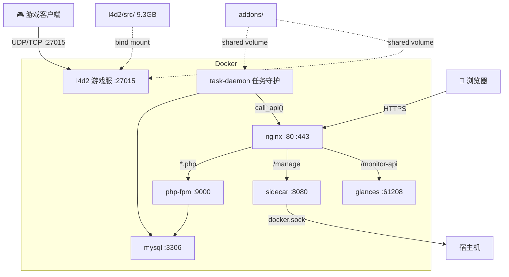

# L4D2 服务器管理平台

基于 Docker 的 Left 4 Dead 2 游戏服务器 + Web 管理面板 + 地图自动下载 + 系统监控。

**技术栈**：Docker Compose / nginx / PHP-FPM / MySQL 8.0 / Glances

---

## 快速开始

```bash
git clone --depth=1 https://github.com/TunArund/L4D2-ServerPack.git && cd L4D2-ServerPack
cp .env.example .env            # 编辑 .env，填入必填变量（见下方环境变量）
./l4d2.sh install               # steamcmd 下载游戏 (~9GB)
./docker.sh install             # 自动安装 Docker (已装则跳过)
./docker.sh build               # 构建镜像
./docker.sh up                  # 启动所有服务
```

---

## 环境变量配置

编辑 `.env`，必填项：

```bash
# ── 数据库 ──
MYSQL_ROOT_PASSWORD=your_root_password
MYSQL_DATABASE=steam
MYSQL_USER=steam
MYSQL_PASSWORD=your_db_password

# ── 内部 API 令牌（sidecar / task-daemon 认证用，建议随机生成）──
SIDECAR_TOKEN=your_random_token

# ── 文件权限（必须与 l4d2/src/ owner 一致，否则容器启动失败）──
APP_UID=1000
APP_GID=1000
```

完整变量列表：

| 变量 | 服务 | 说明 |
|------|------|------|
| `REGISTRY` | 全部 | 镜像前缀。开发留空，生产设 `ghcr.io/<user>/` |
| `TZ` | nginx, php, task-daemon, sidecar (构建时) / mysql (运行时) | 容器时区，默认 `Asia/Shanghai` |
| `MYSQL_ROOT_PASSWORD` | mysql | root 密码 |
| `MYSQL_DATABASE` / `MYSQL_USER` / `MYSQL_PASSWORD` | mysql, php, task-daemon | 数据库 |
| `APP_UID` / `APP_GID` | php, task-daemon, l4d2 | 文件权限，**必须与游戏文件 owner 一致** |
| `GAME_DIR` | l4d2 | 游戏文件目录（默认 `./l4d2/src`） |
| `SIDECAR_TOKEN` | php, sidecar, task-daemon | API 令牌（空 = 跳过认证） |
| `ALLOWED_CONTAINERS` / `RESTARTABLE_CONTAINERS` | sidecar | 容器管理白名单 |
| `L4D2_COOP_ARGS` / `L4D2_VERSUS_ARGS` | l4d2 | srcds 启动参数 |
| `SES_SECRET_ID` / `SES_SECRET_KEY` | php | 腾讯云 SES 邮件（可选） |
| `COS_SECRET_ID` / `COS_SECRET_KEY` | php, task-daemon | 腾讯云 COS API 密钥（可选） |
| `COS_BUCKET` | php, task-daemon | COS 存储桶名称 |
| `COS_REGION` | php, task-daemon | 存储桶地域，默认 `ap-guangzhou` |
| `COS_CUSTOM_DOMAIN` | php, task-daemon | CDN 加速域名（可选） |
| `GITHUB_USER` / `GITHUB_TOKEN` | docker.sh | ghcr.io 推送凭据（可选） |

---

## SSL 证书快速配置

### 阿里云 DNS（推荐）

```bash
# ① 安装 acme.sh
curl https://get.acme.sh | sh && source ~/.bashrc

# ② 获取 AccessKey（https://ram.console.aliyun.com/users → 子用户 → OpenAPI访问）
export Ali_Key="LTAI5t..."
export Ali_Secret="..."

# ③ 申请证书（Let's Encrypt, 自动 DNS TXT 验证）
acme.sh --set-default-ca --server letsencrypt
acme.sh --issue --dns dns_ali -d l4d2.tunarund.top

# ④ 安装到 nginx certs 目录，证书更新后自动 reload
acme.sh --install-cert -d l4d2.tunarund.top \
  --key-file       /home/steam/L4D2-ServerPack/nginx/data/certs/privkey.pem \
  --fullchain-file /home/steam/L4D2-ServerPack/nginx/data/certs/fullchain.pem \
  --reloadcmd      "docker exec l4d2-nginx nginx -s reload"
```

### 腾讯云 DNSPod

```bash
# AccessKey → https://console.dnspod.cn/account/token/token
export DP_Id="你的DNSPod_ID"
export DP_Key="你的DNSPod_Token"
acme.sh --issue --dns dns_dp -d l4d2.tunarund.top
# install-cert 同上
```

nginx 配置路径 `./nginx/data/conf.d/l4d2.conf`。证书 90 天有效，acme.sh 自动添加 cron 续期任务。

---

## 目录结构

```
l4d2-server/
├── docker-compose.yml
├── .env.example
├── docker.sh                   # Docker 管理 (install/build/up/down/push/logs…)
├── l4d2.sh                     # steamcmd 下载/更新游戏
├── test.sh                     # 测试入口 (healthcheck + auto + manual)
├── README.md                    # 项目总览（本文件）
├── CHANGELOG.md                 # 更新日志
│
├── base-php/                   # PHP 基础镜像
├── web/                        # PHP 应用
│   ├── README.md               # Web 架构细节
│   └── src/                    # PHP 源码
├── task-daemon/                # 任务守护进程
│   └── README.md               # daemon 内部细节
├── sidecar/                    # 容器管理 API
│   └── README.md               # API 参考
├── nginx/                      # 反向代理
│   └── README.md               # 路由 & 缓存策略
├── l4d2/                       # 游戏服务器
│   ├── README.md               # 挂载策略 & 配置管理
│   ├── src/                    # 游戏文件 (bind mount, 不进 Git)
│   └── data/{coop,versus}/     # 配置/addons (按模式分离)
├── mysql/
│   ├── README.md               # 数据库结构 & 迁移
│   ├── data/                   # 数据持久化
│   └── initdb/                 # 初始化 SQL
├── test/
│   ├── README.md               # 测试说明
│   ├── script/                  # 测试脚本
│   └── log/                     # 测试日志 (Git 忽略)
└── .env                        # (Git 忽略)
```

---

## 架构



**启动顺序**：`mysql` → `php` + `task-daemon` → `nginx` + `sidecar` + `glances`。`l4d2` 独立启动。

核心流程：用户通过 Web 面板提交地图请求 → php 写入数据库 → `task-daemon` 每 5 秒轮询下载 vpk 到共享 addons 卷 → 每日凌晨自动（或手动）同步到腾讯 COS。详细设计见各服务 README。

---

## 容器清单

| 容器 | 基础镜像 | 大小 | 作用 | 端口 |
|------|----------|------|------|------|
| **nginx** | `nginx:alpine` | ~62MB | 反向代理 + 静态文件 | 80, 443 |
| **php** | `php:8.3-fpm-alpine` | ~100MB | PHP 应用后端 | 9000 |
| **mysql** | `mysql:8.0` | ~799MB | 数据库 | 3306 |
| **task-daemon** | `php:8.3-cli-alpine` | ~100MB | `task_daemon` 地图下载 + 每日维护编排 | — |
| **sidecar** | `php:8.3-cli-alpine` | ~150MB | 容器管理（挂载 docker.sock） | 8080 |
| **glances** | `nicolargo/glances` | ~124MB | 系统监控 REST API（pid:host） | 61208 |
| **l4d2** | `ubuntu:22.04` | ~335MB | 游戏服务器 | 27015/udp+tcp |

> l4d2 镜像仅含 32 位运行库，9.3GB 游戏文件通过 `${GAME_DIR}` bind mount，不进镜像。PHP 服务共用 `base-php` 预编译基础镜像（Alpine + gd/mysqli/pdo），避免重复编译。

---

## L4D2 游戏服务器

镜像仅含 32 位运行库，游戏文件（~9.3GB）通过 `./l4d2.sh install` 下载到 `l4d2/src/` 后 bind mount。同一镜像可被战役服（coop）和对抗服（versus）两个实例复用，通过覆盖挂载实现配置隔离。详见 **[l4d2/README.md](l4d2/README.md)**。

---

## 路由速查

| 路径 | 后端 | 说明 |
|------|------|------|
| `/` `/api/*` | php-fpm | Web 管理面板 + REST API |
| `/manage/*` | sidecar | 容器管理 API（需 Token） |
| `/monitor-api/*` | glances | 系统监控 JSON |
| `*.css/js/png/...` | nginx 直接返回 | 静态资源缓存（30d/5m） |

---

## Sidecar API

| 端点 | 认证 | 说明 |
|------|------|------|
| `GET /manage/health` | — | 健康检查 |
| `GET /manage/containers` | Token | 列出容器（`ALLOWED_CONTAINERS` 白名单） |
| `POST /manage/containers/{name}/restart` | Token | 重启容器（需在 `RESTARTABLE_CONTAINERS` 内） |

> 详见 **[sidecar/README.md](sidecar/README.md)**。

---

## 详细文档

各服务内部架构、数据流、问题排查见各目录下的 README：

| 目录 | 内容 |
|------|------|
| [`web/README.md`](web/README.md) | Web 应用：地图生命周期、API/JS 文件索引、DB 结构、排查指南 |
| [`task-daemon/README.md`](task-daemon/README.md) | 守护进程：主循环、下载流程、COS 同步、每日维护 |
| [`l4d2/README.md`](l4d2/README.md) | 游戏服务器：挂载策略、双实例复用、数据目录管理 |
| [`sidecar/README.md`](sidecar/README.md) | 容器管理 API、认证、白名单 |
| [`nginx/README.md`](nginx/README.md) | 路由分发、SSL、缓存策略 |
| [`mysql/README.md`](mysql/README.md) | 数据库结构、迁移脚本 |
| [`test/README.md`](test/README.md) | 测试类型、运行方式 |

---

## 致谢

https://github.com/KevonLin/l4d2-docker-zonemod 提供了 steamcmd 便捷下载求生之路2服务器文件的指令。

## 已知问题

| 问题 | 说明 |
|------|------|
| docker 镜像拉取超时 | Docker Hub 境内访问受限，解决办法参考 https://github.com/dongyubin/DockerHub |
| steamcmd 下载慢 | 首次 ~9.3GB，可在网络好的机器下载后 scp 到服务器 |
| `APP_UID`/`APP_GID` 不匹配 | `.env` 中 `APP_UID`/`APP_GID` 需与 `l4d2/src/` owner 一致，否则容器构建或启动失败（SourceMod 日志 Permission denied） |
| 挂载目录删不掉 | 大部分容器以 root 创建子目录，宿主普通用户无权删除。优先使用 `sudo rm -rf <目录>`，或 `docker run --rm -v $(pwd):/mnt alpine rm -rf /mnt/<目录>` |
| 新注册用户无法设置管理员 | 网站注册后默认为普通用户，暂无管理后台设置入口。临时通过数据库手动设置：`docker compose exec mysql mysql -u steam -pchange_me -e "UPDATE steam.users SET role='admin' WHERE username='你的用户名';"` |
|各个快捷脚本都放在项目根目录|也许将脚本放入scripts/ 统一入口更好|
