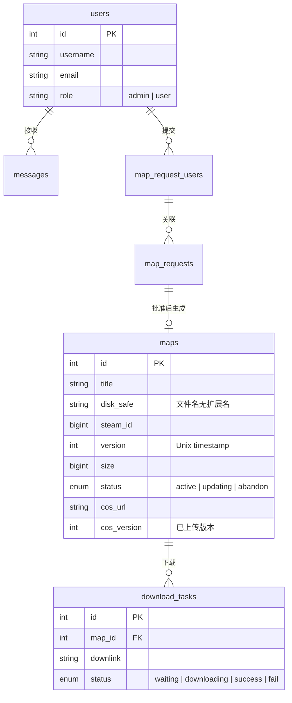

# mysql — 数据库

MySQL 8.0，存储所有业务数据。

## 初始化

`mysql/initdb/` 下的 SQL 文件在容器首次启动时按文件名顺序执行：

| 文件 | 内容 |
|------|------|
| `01-steam.sql` | 完整 DDL：users / maps / download_tasks / map_requests / map_request_users / messages |
| `02-cos.sql` | 增量迁移：maps 表新增 `cos_url` / `cos_version` 列 |

## 核心表



## 存量迁移

首次部署后执行：
```bash
docker exec -i l4d2-mysql mysql -u steam -p steam < mysql/initdb/02-cos.sql
```

## 配置

| 参数 | 说明 |
|------|------|
| `character-set-server=utf8mb4` | 字符集 |
| `collation-server=utf8mb4_unicode_ci` | 排序规则 |
| `MYSQL_ROOT_PASSWORD` | root 密码（`.env`） |
| `MYSQL_DATABASE/USER/PASSWORD` | 应用数据库（`.env`） |

数据持久化到 `mysql/data/`。
