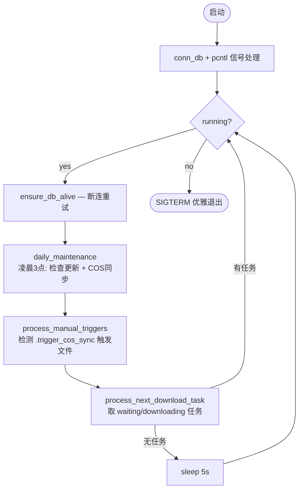

# task-daemon — 任务守护进程

CLI 守护进程，运行 `task_daemon.php`，负责地图下载、COS 同步和每日维护编排。

## 主循环

## 下载流程

`process_next_download_task()` → `fetch_download_task()` 从 `download_tasks` 表取 `waiting` 或 `downloading` 状态的任务 → `download_with_progress()` 用 curl 流式下载 vpk 到 `MAP_DIR`。

**断点续传**：中断后文件保留，下次重试通过 `CURLOPT_RESUME_FROM` 续传。服务器不支持 Range（返回 200 而非 206）时自动删除从头开始。

**回调**：
- 成功 → `downlaod_success_callback()`：更新 download_tasks 状态为 `success`、maps 状态为 `active`、通知相关用户
- 失败 → `downlaod_fail_callback()`：download_tasks → `fail`、maps → `abandon`、通知用户

## COS 同步

`run_cos_sync()` 本地直接执行（addons 卷仅本容器挂载，不走 HTTP API）：

1. `cos_batch_upload()` — 查询 `maps WHERE status='active' AND cos_version != version`，上传变化的 .vpk
2. `cos_sync_index()` — 生成并上传 `index.html`（COS 桶目录浏览页）
3. `cos_cleanup_orphans()` — 删除 COS 中存在但 DB 无对应 active 记录的孤儿 .vpk

**触发方式**：
| 方式 | 机制 |
|------|------|
| 每日凌晨 3 点 | `daily_maintenance()` 直接调用 `run_cos_sync()` |
| Web 面板手动 | php 容器写 `.trigger_cos_sync` 到共享 logs 卷 → 本容器 `process_manual_triggers()` 检测到后执行 |

## 每日维护

`daily_maintenance()` 在凌晨指定小时执行，用持久化标记文件（`.daily_update`）防止重启重复：

1. **地图更新**：`call_api('trigger_update_all')` → HTTP 调用 php 容器 → 从 Steam API 拉取最新版本号 → 写 `download_tasks`
2. **COS 同步**：`run_cos_sync()` 本地执行

`call_api()` 通过 `SIDECAR_TOKEN` 认证，绕过 Web 登录检查。

## 卷挂载

| 宿主机路径 | 容器路径 | 权限 | 用途 |
|-----------|----------|------|------|
| `./web/src/api` | `/var/www/html/api` | ro | include PHP API 文件 |
| `./web/src/static` | `/var/www/html/static` | ro | COS index 模板 |
| `./web/src/task_daemon.php` | `/var/www/html/task_daemon.php` | ro | 入口脚本 |
| `./l4d2/data/coop/addons` | `/var/www/addons` | rw | 下载 vpk + COS 上传读取 |
| `./web/data/logs` | `/var/www/html/logs` | rw | 日志 + 触发文件 |

## 环境变量

| 变量 | 说明 |
|------|------|
| `DB_HOST/DATABASE/USER/PASSWORD` | MySQL 连接 |
| `WEB_HOST` | `call_api()` 目标，默认 `nginx` |
| `MAP_DIR` | vpk 存储路径，默认 `/var/www/addons/workshop/` |
| `LOG_DIR` | 日志路径，默认 `/var/www/html/logs/` |
| `SIDECAR_TOKEN` | 内部 API 认证 |
| `COS_SECRET_ID/KEY/BUCKET/REGION/CUSTOM_DOMAIN` | 腾讯 COS 凭证 |
| `APP_UID/GID` | 文件权限 |

## 相关文件

| 文件 | 说明 |
|------|------|
| `web/src/task_daemon.php` | 守护进程主程序 |
| `web/src/api/downloader.php` | 下载任务管理（`fetch_download_task` / `download_with_progress` / 回调） |
| `web/src/api/cos_client.php` | COS 客户端（上传/删除/列表/索引页/孤儿清理） |
| `web/src/api/tools.php` | 核心库（`conn_db` / `call_api` / `add_log` / 常量定义） |
