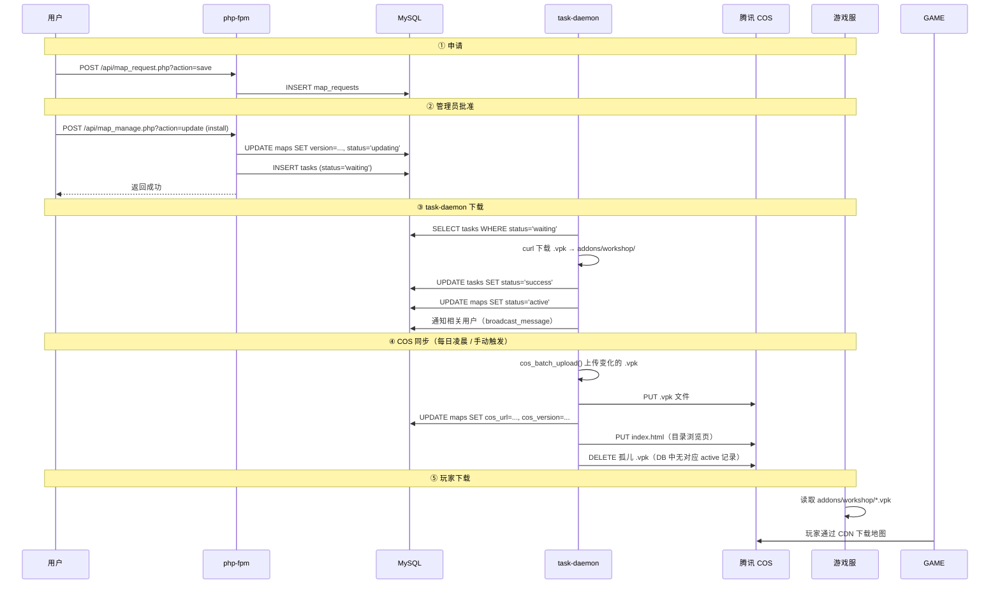
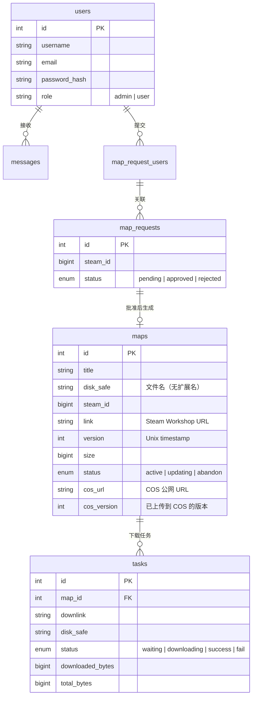

# Web 应用架构

> 仅供开发参考。全局架构见 [README.md](../README.md)，各服务内部细节见对应目录的 README。

## 相关文档

| 文档 | 内容 |
|------|------|
| [../README.md](../README.md) | 全局架构、容器拓扑、卷挂载、路由速查、环境变量 |
| [../task-daemon/README.md](../task-daemon/README.md) | 守护进程主循环、下载流程、COS 同步、每日维护 |
| [../nginx/README.md](../nginx/README.md) | 路由分发、SSL、缓存策略 |
| [../mysql/README.md](../mysql/README.md) | 数据库结构、迁移脚本 |

---

## 1. 地图生命周期



### COS 同步触发方式

| 触发方式 | 流程 |
|----------|------|
| **手动**（Web UI 按钮） | `map_manage.php` 写 `.trigger_cos_sync` → task-daemon 轮询检测 → `run_cos_sync()` |
| **每日自动**（凌晨 3 点） | `daily_maintenance()` → 先 `call_api(trigger_update_all)` → 再 `run_cos_sync()` 本地执行 |
| **daemon 轮询间隔** | 空闲时 5s，有下载任务时立即处理下一个 |

---

## 2. 关键文件索引

### PHP 页面（`web/src/`）

| 文件 | 功能 |
|------|------|
| `index.php` | 首页 |
| `dashboard.php` | 仪表盘（Chart.js 服务器状态） |
| `personal.php` | 个人中心（账户/收件箱/地图申请/地图管理） |
| `map_info.php` | 地图详情 + 下载按钮（COS CDN / Steam CDN） |
| `billboard.php` | 公告板 |
| `navbar.php` | 导航栏组件（`printHeader`/`printNavbar`/`printFooter`） |

### 任务驱动（`web/src/api/lib/`）

| 文件 | 功能 |
|------|------|
| `downloader.php` | **下载任务驱动**：`add_download_task` / `download_with_progress` / 回调 |
| `uploader.php` | **上传任务驱动**：COS 客户端 + `process_upload_task` / `cos_batch_create_tasks` |

### PHP API（`web/src/api/`）

| 文件 | 功能 |
|------|------|
| `tools.php` | 核心库：DB 连接、日志轮转、常量定义（`MAP_DIR`/`LOG_DIR`）、curl 代理 |
| `tasks.php` | 统一任务查询 API（POST `{status, count, type}`） |
| `map_manage.php` | 地图管理 API：list/uninstall/delete/update/update_all/trigger_cos_sync/count |
| `map_request.php` | 地图申请 API |
| `map_request_tools.php` | Steam Workshop API 查询（`fetch_steam_item_by_api`） |
| `login.php` / `register.php` / `logout.php` | 认证 |
| `check_email.php` / `check_email_tools.php` | 邮箱验证 |

### JavaScript（`web/src/static/js/custom/`）

| 文件 | 功能 |
|------|------|
| `tools.js` | 通用工具函数（格式化、分页、选中 ID 收集） |
| `map_manage.js` | 地图管理页面：列表/排序/更新/卸载/删除/COS 同步触发 |
| `map_request.js` | 地图申请页面 |
| `dashboard.js` | 仪表盘（Chart.js 绑数据） |
| `index.js` | 首页 |
| `navbar.js` | 导航栏 |

### 其他

| 文件 | 功能 |
|------|------|
| `static/html/cos_index.html` | COS 目录浏览页模板（`{{COS_BUCKET}}` 等占位符） |

---

## 3. 数据库核心表



**COS 版本比较逻辑：**
```sql
-- cos_batch_upload() 的查询条件
SELECT * FROM maps
WHERE status = 'active'
  AND (cos_version IS NULL OR cos_version != version)
```
`version` 每次"检查更新"会从 Steam API 刷新；上传成功后 `cos_version` 设为 `version`。

---

## 4. 常见问题排查

| 现象 | 可能原因 | 检查方法 |
|------|----------|----------|
| COS 同步全部跳过 | task-daemon 未运行，或 addons 卷无 .vpk | `docker compose ps task-daemon`；`ls l4d2/data/coop/addons/workshop/` |
| 每日更新不生效 | `SIDECAR_TOKEN` 不匹配或为空 | 检查 `.env` 中 token 是否一致 |
| 地图下载后状态不更新 | tasks 回调未执行 | 检查 `task-daemon` 日志 |
| 文件权限错误 | `APP_UID/GID` 与宿主机不一致 | `id steam` 查看 UID |

---

## 5. 后续规划

当前 `lib/` 下的 driver 仍耦合了一些可抽离的通用逻辑，计划进一步分层：

```
web/src/
├── api/                    ← API 端点 + 内嵌 lib 驱动
│   ├── lib/                ← 业务驱动 + 可复用模块
│   │   ├── downloader.php  ← 下载任务驱动
│   │   ├── uploader.php    ← 上传任务驱动（COS）
│   │   ├── dbdriver.php    ← 【待抽离】通用 DB 操作
│   │   ├── cosdriver.php   ← 【待抽离】纯 COS API
│   │   └── ...
│   ├── tasks.php           ← 统一任务查询
│   ├── map_manage.php      ← 地图管理
│   └── ...
└── static/                 ← 前端静态资源
```

**目标**：
- `api/` 目录下的文件仅为 HTTP 入口，不含业务逻辑
- `lib/dbdriver.php` — 从 `tools.php` 和 `downloader.php` 中抽离通用 DB 操作
- `lib/cosdriver.php` — 从 `uploader.php` 中抽离纯 COS API 层（签名/上传/删除/列表），`uploader.php` 仅保留上传任务调度逻辑（`process_upload_task` / `cos_batch_create_tasks`）
- 各 driver 通过 `include_once` 按需组合，避免循环依赖
| 手动触发 COS 同步无响应 | daemon 未运行或触发文件写入失败 | `docker compose ps task-daemon`；检查 `LOG_DIR` 权限 |
