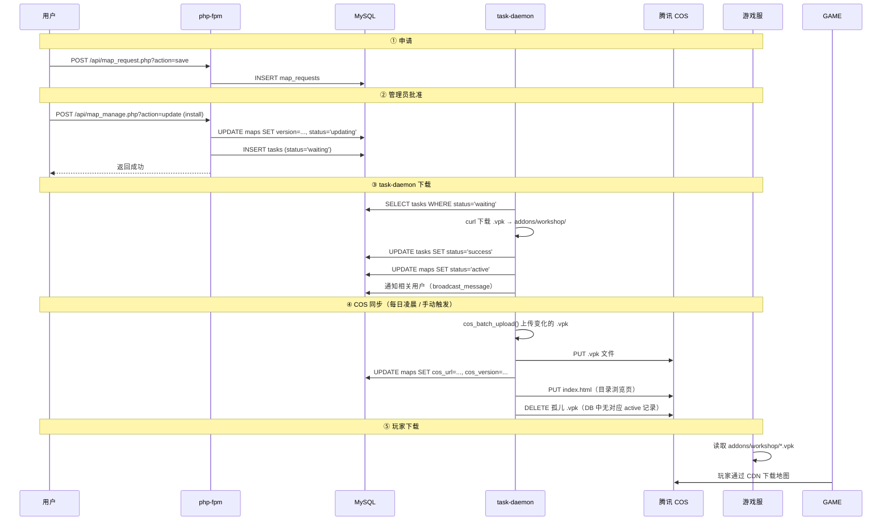
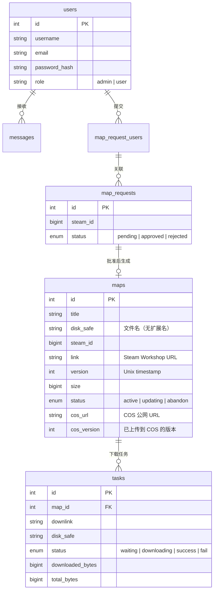

# Web 应用架构

> 仅供开发参考。全局架构见 [README.md](../README.md)，各服务内部细节见对应目录的 README。

## 相关文档

| 文档 | 内容 |
|------|------|
| [../README.md](../README.md) | 全局架构、容器拓扑、卷挂载、路由速查、环境变量 |
| [../task-daemon/README.md](../task-daemon/README.md) | 守护进程主循环、下载流程、COS 同步、每日维护 |
| [../nginx/README.md](../nginx/README.md) | 路由分发、SSL、缓存策略 |
| [../mysql/README.md](../mysql/README.md) | 数据库结构、迁移脚本 |

---

## 1. 目录结构

```
web/src/
├── config.php              ← 路径 / DB / 环境常量
├── lib/                    ← 纯库函数（无 HTTP 入口）
│   ├── core.php            ← DB 连接、日志、格式化、JSON/array helper
│   ├── db.php              ← DB 操作辅助（alive_db / exec_stmt / safe_execute）
│   ├── auth.php            ← 认证 / 权限 / 频率限制
│   ├── steam.php           ← Steam Workshop API 封装
│   ├── map.php             ← 地图 / 申请 业务逻辑
│   ├── download.php        ← 下载任务驱动
│   ├── upload.php          ← COS 上传驱动
│   ├── email.php           ← 邮箱验证码
│   └── debug.php           ← CLI 调试脚本
├── api/                    ← HTTP API 端点（每个文件可独立调用）
│   ├── login.php / logout.php / register.php
│   ├── check_email.php
│   ├── map_manage.php      ← 地图管理（list / update / uninstall / delete / update_all / cos_sync / count）
│   ├── map_request.php     ← 地图申请
│   ├── tasks.php           ← 任务查询
│   ├── delete_comment.php
│   ├── get_unread_count.php
│   └── get_unread_messages.php
├── task_daemon.php         ← CLI 守护进程（下载 / 上传 / COS 同步 / 每日维护）
├── static/                 ← 前端静态资源（JS / CSS / 图片 / HTML 模板）
├── index.php               ← 首页
├── dashboard.php           ← 仪表盘
├── personal.php            ← 个人中心
├── map_info.php            ← 地图详情页
├── billboard.php           ← 公告板
└── navbar.php              ← 导航栏组件
```

### lib/ 函数索引

**core.php** — 项目基石，所有 lib 文件都依赖它：

| 函数 | 用途 |
|------|------|
| `conn_db()` | PDO 数据库连接 |
| `add_log($file, $level, $msg)` | 日志写入（自动按日轮转） |
| `daily_log_path($base)` | 按日轮转日志路径 |
| `check_disk_capacity($bytes)` | 磁盘空间检查 |
| `get_GET($key, $type, $default)` | 安全取 GET 参数 |
| `get_POST($key, $type, $default)` | 安全取 POST 参数 |
| `json_error($msg)` / `json_success($data)` | JSON 响应 + exit |
| `array_error($msg)` / `array_success($data)` | 统一返回结构 |
| `bytes_to_str($bytes)` / `num_to_str($n)` | 格式化数字 |
| `curl_proxy($url)` | cURL 代理请求 |
| `broadcast_message($uids, $title, $msg)` | 批量发送站内消息 |

**db.php** — DB 操作辅助：

| 函数 | 用途 |
|------|------|
| `alive_db($pdo)` | 检查连接是否存活 |
| `exec_stmt($stmt, ...$params)` | 安全执行 prepared statement |
| `safe_execute($pdo, $sql, $params, $retry)` | 带重连的 PDO 执行（daemon 用） |

**auth.php** — 认证 / 权限：

| 函数 | 用途 |
|------|------|
| `check_login()` | 检查登录状态 |
| `check_admin()` | 检查管理员权限 |
| `rate_limit($limit, $window)` | 频率限制 |

**steam.php** — Steam Workshop API：

| 函数 | 用途 |
|------|------|
| `format_steam_item($item)` | 格式化 API 响应 |
| `fetch_steam_item_by_api($steam_id)` | 单个查询 |
| `fetch_steam_items_batch($steam_ids)` | 批量并行查询（curl_multi） |

**map.php** — 地图 / 申请业务逻辑：

| 函数 | 用途 |
|------|------|
| `fetch_db_item($pdo, $steam_id)` | 查 maps / map_requests 是否已有 |
| `fetch_map_request($pdo, ...)` | 查申请记录 |
| `build_map_request($steam_id)` | 构造完整申请（调 Steam API） |
| `bind_user_to_request($pdo, $rid, $uid)` | 绑定用户到申请 |
| `fetch_users_by_request($pdo, $rid)` | 查申请关联用户 |
| `insert_map_request($pdo, $req)` | 写入 map_requests |
| `insert_map($pdo, $map)` | 写入 maps |
| `update_map_info($pdo, $map)` | 更新 maps 信息 |
| `isDownloadLinkValid($url, $timeout)` | 检查下载链接有效性 |

**download.php** — 下载任务驱动：

| 函数 | 用途 |
|------|------|
| `add_download_task($pdo, $url, $disk_safe, $map_id)` | 创建下载任务 |
| `download_with_progress($pdo, $task, $dir, $log)` | curl 流式下载 + 断点续传 + 进度回调 |
| `download_success_callback($pdo, $task)` | 下载完成回调（更新状态 + 通知用户） |
| `download_fail_callback($pdo, $task)` | 下载失败回调 |
| `fetch_related_users($pdo, $map_id)` | 查地图关联用户 |

**upload.php** — COS 上传驱动：

| 函数 | 用途 |
|------|------|
| `cos_configured()` | COS 是否已配置 |
| `cos_batch_create_tasks($pdo)` | 扫描本地 .vpk，批量创建上传任务 |
| `process_upload_task($pdo, $task)` | 处理单个上传任务 |
| `cos_sync_index()` | 同步 COS 目录浏览页 |
| `cos_cleanup_orphans($pdo)` | 清理 COS 孤儿文件 |
| `cos_upload_file($key, $path)` | 上传单个文件 |
| `cos_delete_object($key)` | 删除 COS 对象 |
| `cos_head_object($key)` | HEAD 查询对象元数据 |
| `cos_list_objects($prefix, $delimiter, $max)` | 列出 COS 对象 |
| `cos_host()` / `cos_object_url($key)` | COS 域名 / URL 生成 |

**email.php** — 邮箱验证：

| 函数 | 用途 |
|------|------|
| `sendEmail($to, $code, $expire, ...)` | 发送验证码邮件（SES） |
| `sendmail($to, $subject, $message)` | 通用发信 |
| `genCodeHtml($code, $url, ...)` | 生成验证码 HTML |
| `sign($key, $msg)` | HMAC 签名 |

### lib/ 依赖关系

```
config.php  ← 常量定义
    ↓
core.php    ← 基石（DB连接、日志、array/json helper）
    ↓
db.php      ← core + DB 辅助
auth.php    ← 独立（$_SESSION）
steam.php   ← 独立（curl）
map.php     ← core + db + steam
download.php ← core + db
upload.php  ← 独立（curl + hash_hmac）
email.php   ← 独立（SES SDK）
```

### 命名约定

| 规则 | 示例 |
|------|------|
| `lib/` 文件以功能域命名 | `steam.php`、`download.php` |
| `api/` 文件为实际可调用的端点 | `map_manage.php` |
| 常量全部大写、下划线分隔 | `LIB_DIR`、`MAP_DIR`、`LOG_DIR` |
| include 使用常量路径 | `include_once LIB_DIR . 'core.php'` |
| 入口文件 bootstrap 一行 | `include_once __DIR__ . '/../config.php'` |

---

## 2. 地图生命周期



### COS 同步触发方式

| 触发方式 | 流程 |
|----------|------|
| **手动**（Web UI 按钮） | `map_manage.php` → 写 `.cos_sync` → task-daemon 轮询检测 → `run_cos_sync()` |
| **每日自动**（凌晨 3 点） | `daily_maintenance()` → 先 `call_api(update_all)` → 再 `run_cos_sync()` 本地执行 |
| **daemon 轮询间隔** | 空闲时 5s，有下载任务时立即处理下一个 |

### `update_all` 并行优化

`update_all` 通过 `curl_multi` 并行拉取所有地图的 Steam 信息，再逐个比较版本并创建下载任务，避免串行外呼导致超时。

```
update_all → 查 DB 出行数据 → fetch_steam_items_batch（并行）→ apply_map_update × N
```

---

## 3. 数据库核心表



**COS 版本比较逻辑：**
```sql
-- cos_batch_upload() 的查询条件
SELECT * FROM maps
WHERE status = 'active'
  AND (cos_version IS NULL OR cos_version != version)
```
`version` 每次"检查更新"会从 Steam API 刷新；上传成功后 `cos_version` 设为 `version`。

---

## 4. 日志

所有日志通过 `core.php` 的 `daily_log_path()` 按日轮转，PHP error_log 统一指向当日文件：

```
logs/
├── task_daemon/2026/07/14.log          ← daemon 业务日志 + PHP 错误
├── map_manage_error/2026/07/14.log     ← map_manage.php PHP 错误
├── map_request_error/2026/07/14.log    ← map_request.php PHP 错误
└── debug/2026/07/14.log               ← debug.php PHP 错误
```

task-daemon（常驻进程）主循环中检测跨日自动刷新 `ini_set('error_log', ...)`。

---

## 5. 常见问题排查

| 现象 | 可能原因 | 检查方法 |
|------|----------|----------|
| COS 同步全部跳过 | task-daemon 未运行，或 addons 卷无 .vpk | `docker compose ps task-daemon`；`ls l4d2/data/coop/addons/workshop/` |
| 每日更新不生效 | `SIDECAR_TOKEN` 不匹配或为空 | 检查 `.env` 中 token 是否一致 |
| 地图下载后状态不更新 | tasks 回调未执行 | 检查 `task-daemon` 日志 |
| 文件权限错误 | `APP_UID/GID` 与宿主机不一致 | `id $USER` 查看 UID |
| API 返回 connect/http/json 错误 | 见 `call_api()` 返回值区分 | 检查 daemon 日志中的具体 error 类型 |
## 6. Bugs
- dashboard 第一行卡片car-haeader被悬浮的navbar遮挡
- dashboard medium屏幕大小 任务显示异常 每条任务仍按三列布局，而不像sm模式换行
- dashboard 任务信息不详细，预期
任务名\t时间
|已处理大小|处理速度|未处理大小|
|进度条|处理百分比|进度条|
|已处理时间||预期剩余时间|

- api中存在数据库表直接操作，应全部抽离封装到lib中