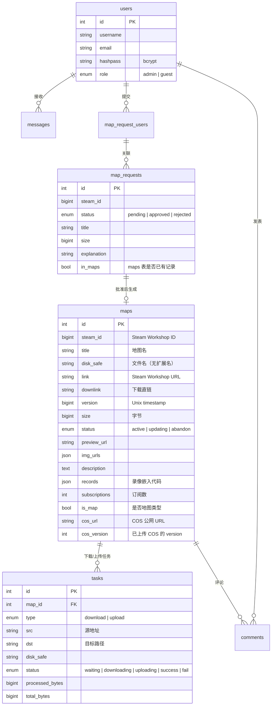
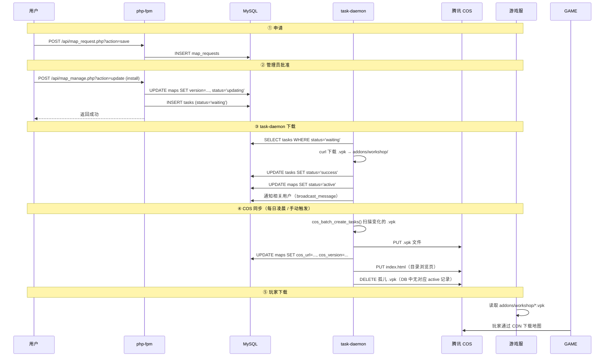

# Web 应用架构

> 仅供开发参考。全局架构见 [../README.md](../README.md)，各服务内部细节见对应目录的 README。

## 相关文档

| 文档 | 内容 |
|------|------|
| [../README.md](../README.md) | 全局架构、容器拓扑、卷挂载、路由速查、环境变量 |
| [../task-daemon/README.md](../task-daemon/README.md) | 守护进程主循环、下载流程、COS 同步、每日维护 |
| [../nginx/README.md](../nginx/README.md) | 路由分发、SSL、缓存策略 |
| [../mysql/README.md](../mysql/README.md) | 数据库结构、迁移脚本 |

---

## 1. 目录结构

```
web/src/
├── config.php                  ← 全局路径/DB/环境常量
├── lib/                        ← 纯库函数（无 HTTP 入口）
│   ├── core.php                ← DB 连接、日志、格式化、JSON/array helper
│   ├── db.php                  ← DB 操作辅助（alive_db / exec_stmt / safe_execute）
│   ├── auth.php                ← 认证 / 权限 / CSRF / 频率限制
│   ├── steam.php               ← Steam Workshop API 封装（单条 + 批量 curl_multi）
│   ├── map.php                 ← 地图 & 申请 业务逻辑（CRUD、审核、更新）
│   ├── task.php                ← 任务查询
│   ├── download.php            ← 下载任务驱动（断点续传 + 进度回调）
│   ├── upload.php              ← 腾讯 COS 上传驱动（HMAC-SHA1 签名）
│   ├── email.php               ← 腾讯 SES 邮箱验证码（TC3-HMAC-SHA256 签名）
│   └── debug.php               ← CLI 调试脚本
├── api/                        ← HTTP API 端点（每个文件可独立调用）
│   ├── login.php / logout.php / register.php
│   ├── check_email.php
│   ├── map_manage.php          ← 地图管理（list / update / uninstall / delete / update_all / cos_sync / count）
│   ├── map_request.php         ← 地图申请（add / list / approve / delete / count）
│   ├── tasks.php               ← 下载/上传任务查询
│   ├── delete_comment.php
│   ├── get_unread_count.php
│   └── get_unread_messages.php
├── task_daemon.php             ← CLI 守护进程（下载 / 上传 / COS 同步 / 每日维护）
├── static/                     ← 前端静态资源
│   ├── css/                    ← Bootstrap 5
│   ├── js/
│   │   ├── bootstrap.bundle.min.js
│   │   ├── jquery-3.7.1.min.js
│   │   ├── chart.umd.min.js    ← Chart.js（dashboard 资源图表）
│   │   └── custom/             ← 业务 JS（navbar、dashboard、map_manage、map_request、index）
│   ├── font/                   ← Bootstrap Icons
│   ├── img/ / audio/ / video/  ← 媒体资源
│   └── html/                   ← COS 目录浏览页模板等
├── index.php                   ← 首页（全屏视频 + 服务器信息）
├── dashboard.php               ← 仪表盘（下载/上传任务 + 服务器资源 + Docker 管理）
├── personal.php                ← 个人中心（账户 / 收件箱 / 地图申请 / 地图管理）
├── map_info.php                ← 地图详情页（图片轮播 + 评论 + 下载按钮）
├── billboard.php               ← 地图列表（搜索 / 分页 / 排序）
└── navbar.php                  ← 共享导航栏组件 + CSRF meta 标签
```

## 2. 技术栈

| 维度 | 选择 |
|------|------|
| 语言 | PHP 8.x（原生，无框架） |
| 包管理 | 无 Composer，无 composer.json |
| 数据库 | MySQL 8.0，PDO 连接 |
| 前端 | Bootstrap 5 + Chart.js + jQuery 3.7 + 原生 JS |
| 运行时 | Docker Compose → nginx + php-fpm + MySQL + task-daemon |
| 外部服务 | steamworkshopdownloader.io API、腾讯 COS（HMAC-SHA1）、腾讯 SES（TC3-HMAC-SHA256） |

### 页面入口（无前端控制器/路由）

项目没有集中式路由，每个 PHP 文件独立作为入口点，直接通过 URL 路径访问：

```
/                          → index.php
/billboard.php             → billboard.php
/map_info.php?id=X         → map_info.php
/personal.php?tab=X        → personal.php
/dashboard.php             → dashboard.php
/api/login.php             → api/login.php
/api/map_manage.php?action= → api/map_manage.php
/api/map_request.php?action= → api/map_request.php
/api/tasks.php             → api/tasks.php
...
```

`map_manage.php` 和 `map_request.php` 通过 `?action=` 参数做内部分发（switch-case）。

`task_daemon.php` 只能通过命令行运行（`php task_daemon.php`），不通过 HTTP 访问。

## 3. lib/ 函数索引

### core.php — 项目基石

所有 `lib/` 文件都依赖它。

| 函数 | 用途 |
|------|------|
| `conn_db()` | PDO 数据库连接 |
| `add_log($file, $level, $msg)` | 日志写入（自动按日轮转） |
| `daily_log_path($base)` | 按日轮转日志路径 |
| `check_disk_capacity($bytes)` | 磁盘空间检查 |
| `get_GET($key, $type, $default)` | 安全取 GET 参数 |
| `get_POST($key, $type, $default)` | 安全取 POST 参数 |
| `json_error($msg)` / `json_success($data)` | JSON 响应 + exit |
| `json_from(array $result)` | `array_error/success` → JSON 桥接 |
| `array_error($msg)` / `array_success($data)` | 统一返回结构 |
| `bytes_to_str($bytes)` / `num_to_str($n)` | 格式化数字 |
| `curl_proxy($url)` | cURL 代理请求 |
| `broadcast_message($uids, $title, $msg)` | 批量发送站内消息 |
| `post_ids()` | 解析 JSON POST body 中的 ids 数组 |

### db.php — 数据库操作辅助

| 函数 | 用途 |
|------|------|
| `alive_db($pdo)` | 检查连接是否存活（`SELECT 1`） |
| `exec_stmt($stmt, ...$params)` | 安全执行 prepared statement |
| `safe_execute($pdo, $sql, $params, $retry)` | 带重连的 PDO 执行（daemon 长连接用） |

### auth.php — 认证 / 权限 / 安全

| 函数 | 用途 |
|------|------|
| `check_login()` | 检查登录状态（自动 `session_start()`） |
| `check_admin()` | 检查管理员权限 |
| `csrf_token()` | 生成/获取 CSRF token |
| `csrf_hidden_field()` | 生成 CSRF 隐藏表单字段 HTML |
| `verify_csrf()` | 验证 CSRF token（支持 POST 字段和 `X-CSRF-Token` header） |
| `rate_limit($limit, $window)` | 频率限制（session 级别） |

### steam.php — Steam Workshop API

| 函数 | 用途 |
|------|------|
| `format_steam_item($item)` | 格式化 API 响应 |
| `fetch_steam_item_by_api($steam_id)` | 单个查询 |
| `fetch_steam_items_batch($steam_ids)` | 批量并行查询（curl_multi） |

### map.php — 地图 / 申请业务逻辑

| 函数 | 用途 |
|------|------|
| `fetch_db_item($pdo, $steam_id)` | 查 maps / map_requests 是否已有 |
| `fetch_map_request($pdo, ...)` | 查申请记录 |
| `build_map_request($steam_id)` | 构造完整申请（调 Steam API） |
| `bind_user_to_request($pdo, $rid, $uid)` | 绑定用户到申请 |
| `fetch_users_by_request($pdo, $rid)` | 查申请关联用户 |
| `insert_map_request($pdo, $req)` | 写入 map_requests |
| `insert_map($pdo, $map)` | 写入 maps |
| `update_map_info($pdo, $map)` | 更新 maps 信息 |
| `isDownloadLinkValid($url, $timeout)` | 检查下载链接有效性 |
| `list_map($pdo, ...)` | 分页/排序查询 maps |
| `uninstall_map($pdo, $id)` | 卸载地图（改状态 + 删文件） |
| `delete_map($pdo, $id)` | 删除地图（卸载 + 删记录） |
| `apply_map_update($pdo, ...)` | 单图版本比较 → 更新 |
| `update_maps($pdo, $map_rows)` | 批量更新（内部并行 Steam API） |
| `count_map($pdo)` | 地图总数 |
| `add_request($pdo, $uid, $steam_id)` | 添加地图申请 |
| `approve_request($pdo, $request_id)` | 批准申请（创建下载任务） |
| `delete_request($pdo, ...)` | 删除申请（含关联关系） |
| `delete_all_request($pdo, $steam_id)` | 删除同一 steam_id 的历史申请 |
| `count_request($pdo)` / `list_request($pdo, ...)` | 申请查询 |

### download.php — 下载任务驱动

| 函数 | 用途 |
|------|------|
| `add_download_task($pdo, $url, $disk_safe, $map_id)` | 创建下载任务（防重复） |
| `download_with_progress($pdo, $task, $dir, $log)` | curl 流式下载 + 断点续传 + 进度回调 |
| `download_success_callback($pdo, $task)` | 完成回调（更新状态 + 通知用户） |
| `download_fail_callback($pdo, $task)` | 失败回调 |
| `fetch_related_users($pdo, $map_id)` | 查地图关联用户 |

### upload.php — COS 上传驱动

使用 HMAC-SHA1（AWS S3 V2 兼容格式）签名，直接调用 COS REST API，无需 SDK。

| 函数 | 用途 |
|------|------|
| `cos_configured()` | COS 是否已配置 |
| `cos_batch_create_tasks($pdo)` | 扫描本地 .vpk + COS 完整性检查，批量创建上传任务 |
| `process_upload_task($pdo, $task)` | 处理单个上传任务（进度回调 + 写完 cos_version） |
| `cos_sync_index()` | 同步 COS 目录浏览页（index.html） |
| `cos_cleanup_orphans($pdo)` | 清理 COS 孤儿文件 |
| `cos_upload_file($key, $path)` | 流式上传单个文件（CURLOPT_INFILE） |
| `cos_delete_object($key)` | 删除 COS 对象 |
| `cos_head_object($key)` | HEAD 查询对象元数据 |
| `cos_list_objects($prefix, ...)` | 列出 COS 对象（解析 XML 响应） |
| `cos_host()` / `cos_object_url($key)` | COS 域名 / URL 生成 |

### email.php — 邮箱验证

| 函数 | 用途 |
|------|------|
| `sendEmail($to, $code, $expire, ...)` | 发送验证码邮件（腾讯 SES TC3-HMAC-SHA256） |
| `sendmail($to, $subject, $message)` | 通用发信（PHP mail / postfix） |
| `genCodeHtml($code, $url, ...)` | 生成验证码 HTML 邮件内容 |

### task.php — 任务查询

| 函数 | 用途 |
|------|------|
| `query_tasks($pdo, $status, $count, $type)` | 查询下载/上传任务列表 |

## 4. lib/ 依赖关系

```
config.php  ← 常量定义
    ↓
core.php    ← 基石（DB连接、日志、array/json helper）
    ↓
db.php      ← core + DB 辅助
auth.php    ← 独立（$_SESSION）
steam.php   ← 独立（curl）
map.php     ← core + db + steam + download
task.php    ← core
download.php ← core + db
upload.php  ← 独立（curl + hash_hmac）
email.php   ← core（BRAND 常量）
```

### 命名约定

| 规则 | 示例 |
|------|------|
| `lib/` 文件以功能域命名 | `steam.php`、`download.php` |
| `api/` 文件为实际可调用的端点 | `map_manage.php` |
| 常量全部大写、下划线分隔 | `LIB_DIR`、`MAP_DIR`、`LOG_DIR` |
| include 使用常量路径 | `include_once LIB_DIR . 'core.php'` |
| 入口文件 bootstrap 一行 | `include_once __DIR__ . '/../config.php'` |

## 5. 数据库核心表



### COS 版本比较逻辑

```sql
-- cos_batch_create_tasks() 的查询条件
SELECT * FROM maps
WHERE status = 'active'
  AND (cos_version IS NULL OR cos_version != version)
```

`version` 每次"检查更新"会从 Steam API 刷新；上传成功后 `cos_version` 设为 `version`。

## 6. 地图生命周期



### COS 同步触发方式

| 触发方式 | 流程 |
|----------|------|
| **手动**（Web UI 按钮） | `map_manage.php` → 写 `.cos_sync` → task-daemon 轮询检测 → `run_cos_sync()` |
| **每日自动**（凌晨 3 点） | `daily_maintenance()` → 先 `call_api(update_all)` → 再 `run_cos_sync()` 本地执行 |
| **daemon 轮询间隔** | 空闲时 5s，有下载/上传任务时立即处理下一个 |

### update_all 并行优化

`update_all` 通过 `curl_multi` 并行拉取所有地图的 Steam 信息，再逐个比较版本并创建下载任务，避免串行外呼导致超时。

```
update_all → 查 DB 出行数据 → fetch_steam_items_batch（并行）→ apply_map_update × N
```

## 7. task-daemon 任务优先级

```
1. download waiting     ← 新下载任务
2. download downloading ← 下载中断续传
3. upload waiting       ← 新上传任务
4. upload uploading     ← 上传中断恢复（daemon 强制重启后）
```

## 8. 认证流程

| 调用方 | 认证方式 |
|--------|---------|
| 浏览器用户 | Session（login → `$_SESSION['user_id']`） |
| task-daemon → PHP API | `SIDECAR_TOKEN`（`hash_equals` 比对，通过 `?token=` 传递） |
| 前端 JS → API | Session cookie 自动携带 + `X-CSRF-Token` header（全局 fetch 拦截注入） |

## 9. 日志

所有日志通过 `core.php` 的 `daily_log_path()` 按日轮转，PHP `error_log` 统一指向当日文件：

```
logs/
├── task_daemon/2026/07/14.log          ← daemon 业务日志 + PHP 错误
├── map_manage_error/2026/07/14.log     ← map_manage.php PHP 错误
├── map_request_error/2026/07/14.log    ← map_request.php PHP 错误
└── debug/2026/07/14.log               ← debug.php PHP 错误
```

task-daemon 主循环中检测跨日自动刷新 `ini_set('error_log', ...)`。

## 10. 常见问题排查

| 现象 | 可能原因 | 检查方法 |
|------|----------|----------|
| COS 同步全部跳过 | task-daemon 未运行，或 addons 卷无 .vpk | `docker compose ps task-daemon`；`ls l4d2/data/coop/addons/workshop/` |
| 每日更新不生效 | `SIDECAR_TOKEN` 不匹配或为空 | 检查 `.env` 中 token 是否一致 |
| 地图下载后状态不更新 | tasks 回调未执行 | 检查 `task-daemon` 日志 |
| 文件权限错误 | `APP_UID/GID` 与宿主机不一致 | `id $USER` 查看 UID |
| API 返回 connect/http/json 错误 | 见 `call_api()` 返回值区分 | 检查 daemon 日志中的具体 error 类型 |

## 11. 待办

- **dashboard UI**：卡片 header 被悬浮 navbar 遮挡；中等屏幕任务显示异常；任务信息不详细（缺少速度、预计剩余时间）
- **泛用化**：通过 `.env` 和 `config.php` 适配不同 IP、品牌名称、备案号
