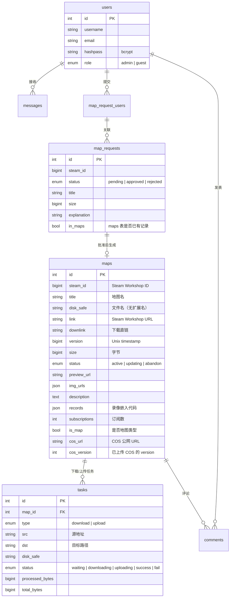

# Web 应用架构

> 仅供开发参考。全局架构见 [../README.md](../README.md)，各服务内部细节见对应目录的 README。

## 相关文档

| 文档 | 内容 |
|------|------|
| [../README.md](../README.md) | 全局架构、容器拓扑、卷挂载、路由速查、环境变量 |
| [../task-daemon/README.md](../task-daemon/README.md) | 守护进程主循环、下载流程、COS 同步、每日维护 |
| [../nginx/README.md](../nginx/README.md) | 路由分发、SSL、缓存策略 |
| [../mysql/README.md](../mysql/README.md) | 数据库结构、迁移脚本 |
| [2026-07-17-architecture-simplify.md](2026-07-17-architecture-simplify.md) | 架构简化方案（2026-07-17 实施） |
| [2026-07-16-architecture-discussion.md](2026-07-16-architecture-discussion.md) | 架构讨论记录 |

---

## 1. 目录结构

```
web/src/
├── etc/                              ← 配置与启动
│   ├── config.php                    ← 全局路径/DB/环境常量
│   └── bootstrap.php                 ← HTTP 前置加载（nginx auto_prepend_file）
│
├── bin/                              ← CLI 脚本（HTTP 不可达）
│   ├── task_daemon.php               ← 下载/上传守护进程
│   └── debug.php                     ← 开发调试工具
│
├── lib/                              ← 基础设施 + 外部驱动
│   ├── core.php                      ← DB 连接、日志、格式化、JSON/array helper
│   ├── db.php                        ← PDO 辅助（exec_stmt / safe_execute / db_fetch_* 查询 helper）
│   ├── auth.php                      ← 认证 / 权限 / CSRF / 频率限制
│   ├── steam.php                     ← Steam Workshop API 封装（单条 + 批量 curl_multi）
│   ├── cos.php                       ← 腾讯 COS 上传驱动（HMAC-SHA1 签名）
│   ├── ses.php                       ← 腾讯 SES 邮箱验证码（TC3-HMAC-SHA256 签名）
│   └── download.php                  ← 下载任务驱动（断点续传 + 进度回调）
│
├── tables/                           ← 数据库操作函数（一个文件一张表，纯函数）
│   ├── users.php                     ← users 表
│   ├── maps.php                      ← maps 表（含地图业务复用函数）
│   ├── tasks.php                     ← tasks 表（含 daemon 专用函数）
│   ├── map_requests.php              ← map_requests 表
│   ├── map_request_users.php         ← map_request_users 关联表
│   ├── messages.php                  ← messages 表
│   ├── comments.php                  ← comments 表
│   └── emails.php                    ← emails 表
│
├── api/                              ← HTTP API 端点（Transaction Script）
│   ├── login.php / logout.php / register.php
│   ├── check_email.php
│   ├── map_manage.php                ← 地图管理（list / uninstall / delete / update / update_all / cos_sync / count）
│   ├── map_request.php               ← 地图申请（add / list / approve / delete / count）
│   ├── tasks.php                     ← 下载/上传任务查询
│   ├── delete_comment.php
│   └── messages.php                  ← 未读消息（count / list）
│
├── static/                           ← 前端静态资源
│   ├── css/
│   │   ├── bootstrap.min.css         ← Bootstrap 5
│   │   └── custom/                   ← 自定义样式
│   │       ├── global.css            ← 全局（导航栏、body、品牌色）
│   │       ├── dashboard.css         ← dashboard.php
│   │       └── billboard.css         ← billboard.php
│   ├── js/
│   │   ├── bootstrap.bundle.min.js
│   │   ├── jquery-3.7.1.min.js
│   │   ├── chart.umd.min.js          ← Chart.js（dashboard 资源图表）
│   │   └── custom/                   ← 业务 JS
│   │       ├── tools.js              ← 共享工具（formatBytes, renderPagination, …）
│   │       ├── navbar.js             ← 导航栏 CSRF 拦截 + 收件箱预览
│   │       ├── dashboard.js          ← 仪表盘（任务面板 + 资源图表 + 容器管理）
│   │       ├── index.js              ← 首页（服务器状态 + 复制按钮）ES module
│   │       ├── billboard.js          ← 地图列表（分页跳转）
│   │       ├── personal.js           ← 个人中心（收件箱操作）
│   │       ├── map_manage.js         ← 地图管理 ES module
│   │       └── map_request.js        ← 地图申请 ES module
│   ├── font/                         ← Bootstrap Icons
│   ├── img/ / audio/ / video/        ← 媒体资源
│   └── html/                         ← COS 目录浏览页模板等
│
├── index.php                         ← 首页（全屏视频 + 服务器信息）
├── dashboard.php                     ← 仪表盘（下载/上传任务 + 服务器资源 + Docker 管理）
├── personal.php                      ← 个人中心（账户 / 收件箱 / 地图申请 / 地图管理）
├── map_info.php                      ← 地图详情页（图片轮播 + 评论 + 下载按钮）
├── billboard.php                     ← 地图列表（搜索 / 分页 / 排序）
└── navbar.php                        ← 共享导航栏组件 + CSRF meta 标签
```

## 2. 技术栈

| 维度 | 选择 |
|------|------|
| 语言 | PHP 8.x（原生，无框架） |
| 包管理 | 无 Composer，无 composer.json |
| 数据库 | MySQL 8.0，PDO 连接 |
| 前端 | Bootstrap 5 + Chart.js + jQuery 3.7 + 原生 JS |
| 运行时 | Docker Compose → nginx + php-fpm + MySQL + task-daemon |
| 外部服务 | steamworkshopdownloader.io API、腾讯 COS（HMAC-SHA1）、腾讯 SES（TC3-HMAC-SHA256） |
| 架构模式 | Page Controller + Transaction Script + Row Data Gateway（Fowler PEAA） |

### 页面入口（无前端控制器/路由）

项目没有集中式路由，每个 PHP 文件独立作为入口点，直接通过 URL 路径访问：

```
/                          → index.php
/billboard.php             → billboard.php
/map_info.php?id=X         → map_info.php
/personal.php?tab=X        → personal.php
/dashboard.php             → dashboard.php
/api/login.php             → api/login.php
/api/map_manage.php?action= → api/map_manage.php
/api/map_request.php?action= → api/map_request.php
/api/tasks.php             → api/tasks.php
/api/messages.php?type=   → api/messages.php
...
```

`map_manage.php` 和 `map_request.php` 通过 `?action=` 参数做内部分发（switch-case）。

`task_daemon.php` 只能通过命令行运行（`php bin/task_daemon.php`），不通过 HTTP 访问。

## 3. 函数索引

### core.php — 项目基石

所有 `lib/` 文件都依赖它。

| 函数 | 用途 |
|------|------|
| `conn_db()` | PDO 数据库连接（单例） |
| `add_log($file, $level, $msg)` | 日志写入（自动按日轮转） |
| `daily_log_path($base)` | 按日轮转日志路径 |
| `check_disk_capacity($bytes)` | 磁盘空间检查 |
| `get_GET($key, $type, $default)` | 安全取 GET 参数 |
| `get_POST($key, $type, $default)` | 安全取 POST 参数 |
| `json_error($msg)` / `json_success($data)` | JSON 响应 + exit |
| `json_from(array $result)` | `array_error/success` → JSON 桥接 |
| `array_error($msg)` / `array_success($data)` | 统一返回结构 |
| `bytes_to_str($bytes)` / `num_to_str($n)` | 格式化数字 |
| `curl_proxy($url)` | cURL 代理请求 |
| `broadcast_message($user_ids, $title, $msg)` | 批量发送站内消息 |
| `post_ids()` | 解析 JSON POST body 中的 ids 数组 |

### db.php — 数据库操作辅助

| 函数 | 用途 |
|------|------|
| `alive_db($pdo)` | 检查连接是否存活（`SELECT 1`） |
| `exec_stmt($stmt, ...$params)` | 安全执行 prepared statement |
| `safe_execute($pdo, $sql, $params, $retry)` | 带重连的 PDO 执行（daemon 长连接用） |
| `db_fetch_all($sql, $params)` | 查询多行 → `array_success(rows)` |
| `db_fetch_one($sql, $params)` | 查询单行 → `array_success(row\|null)` |
| `db_fetch_column($sql, $params, $col)` | 查询标量 → `array_success(value)` |
| `db_insert($sql, $params)` | INSERT → `array_success(lastInsertId)` |
| `db_execute_write($sql, $params)` | UPDATE/DELETE → `array_success(rowCount)` |
| `db_validate_order_by($col, $allowed, $default)` | ORDER BY 白名单校验 |
| `db_validate_order($order)` | ASC/DESC 校验 |

### auth.php — 认证 / 权限 / 安全

| 函数 | 用途 |
|------|------|
| `check_login()` | 检查登录状态（自动 `session_start()`） |
| `check_admin()` | 检查管理员权限 |
| `csrf_token()` | 生成/获取 CSRF token |
| `csrf_hidden_field()` | 生成 CSRF 隐藏表单字段 HTML |
| `verify_csrf()` | 验证 CSRF token（支持 POST 字段和 `X-CSRF-Token` header） |
| `rate_limit($limit, $window)` | 频率限制（session 级别） |

### steam.php — Steam Workshop API

| 函数 | 用途 |
|------|------|
| `format_steam_item($item)` | 格式化 API 响应 |
| `fetch_steam_item_by_api($steam_id)` | 单个查询 |
| `fetch_steam_items_batch($steam_ids)` | 批量并行查询（curl_multi） |

### cos.php — COS 上传驱动

使用 HMAC-SHA1（AWS S3 V2 兼容格式）签名，直接调用 COS REST API，无需 SDK。

| 函数 | 用途 |
|------|------|
| `cos_configured()` | COS 是否已配置 |
| `cos_batch_create_tasks($pdo)` | 扫描本地 .vpk + COS 完整性检查，批量创建上传任务 |
| `process_upload_task($pdo, $task)` | 处理单个上传任务（进度回调 + 写完 cos_version） |
| `cos_sync_index()` | 同步 COS 目录浏览页（index.html） |
| `cos_cleanup_orphans($pdo)` | 清理 COS 孤儿文件 |
| `cos_upload_file($key, $path)` | 流式上传单个文件（CURLOPT_INFILE） |
| `cos_delete_object($key)` | 删除 COS 对象 |
| `cos_head_object($key)` | HEAD 查询对象元数据 |
| `cos_list_objects($prefix, ...)` | 列出 COS 对象（解析 XML 响应） |
| `cos_host()` / `cos_object_url($key)` | COS 域名 / URL 生成 |

### ses.php — 邮箱验证

| 函数 | 用途 |
|------|------|
| `sendEmail($to, $code, $expire, ...)` | 发送验证码邮件（腾讯 SES TC3-HMAC-SHA256） |
| `sendmail($to, $subject, $message)` | 通用发信（PHP mail / postfix） |
| `genCodeHtml($code, $url, ...)` | 生成验证码 HTML 邮件内容 |

### download.php — 下载任务驱动

| 函数 | 用途 |
|------|------|
| `download_with_progress($pdo, $task, $dir, $log, $retries)` | curl 流式下载 + 断点续传 + 进度回调 |
| `download_success_callback($pdo, $task)` | 完成回调（更新状态 + 通知用户） |
| `download_fail_callback($pdo, $task)` | 失败回调 |

### tables/ — 数据访问层

> 一个文件一张表，全部为纯函数。每个文件内的函数命名以表名为前缀（如 `find_map_by_id`、`insert_user`）。部分文件含跨表查询和业务复用函数。

| 文件 | 对应表 | 核心函数 |
|------|--------|---------|
| `users.php` | users | `find_user_by_id`, `find_user_by_username`, `insert_user`, `user_email_exists` |
| `maps.php` | maps | `find_map_by_id`, `list_maps`, `count_maps`, `insert_map`, `update_map`, `update_map_status`, `update_map_cos_info`, `uninstall_map`, `update_maps` |
| `tasks.php` | tasks | `query_tasks`, `insert_task`, `update_task_status`, `update_task_progress` + daemon 专用 `fetch_next_download_task` / `safe_update_task_status` |
| `map_requests.php` | map_requests | `find_request_by_id`, `list_requests`, `list_requests_by_user`, `insert_request`, `update_request_status`, `delete_request` |
| `map_request_users.php` | map_request_users | `bind_request_user`, `get_user_ids_by_request`, `get_user_ids_by_steam_id`, `delete_requests_by_request_id` |
| `messages.php` | messages | `count_unread_messages`, `list_unread_messages`, `list_messages_by_user`, `broadcast_messages`, `mark_message_read`, `delete_messages` |
| `comments.php` | comments | `list_comments_by_map`, `insert_comment`, `delete_comment` |
| `emails.php` | emails | `find_email`, `upsert_email` |

## 4. 请求生命周期与依赖关系

### 4.1 bootstrap.php — 统一前置加载

所有通过 nginx → PHP-FPM 的请求自动执行 `bootstrap.php`（由 nginx `fastcgi_param PHP_VALUE "auto_prepend_file=..."` 注入，无需业务文件手动 include）：

```
nginx fastcgi_param
    ↓
etc/bootstrap.php  ← session_start / CSRF token 初始化 / require config + core + db + auth + tables/*
    ↓
业务文件（api/*.php / *.php）← 直接写业务逻辑，无需重复 include
```

CLI 脚本（`bin/task_daemon.php`、`bin/debug.php`）不走 nginx，独立引导，手动 include 所需文件。

### 4.2 依赖关系

```
etc/config.php     ← 常量定义
    ↓
lib/core.php       ← 基石（DB连接、日志、array/json helper）
    ↓
lib/db.php         ← DB 辅助（exec_stmt + db_fetch_* helper 系列）
lib/auth.php       ← 独立（$_SESSION）
tables/*.php       ← 数据访问函数（依赖 db.php + core.php）
    ↓
lib/steam.php      ← Steam API（独立，curl）
lib/cos.php        ← COS 上传驱动（curl + hash_hmac，数据访问调 tables/）
lib/ses.php        ← SES 发信（curl + hash_hmac）
lib/download.php   ← 下载驱动（curl + 文件 + 进度回调，数据访问调 tables/）
    ↓
api/*.php          ← API 入口（Transaction Script，调 tables/ + lib/）
*.php              ← 页面入口（Page Controller，调 tables/ + lib/）
```

> `etc/bootstrap.php` 自动加载 config + core + db + auth + tables/*（HTTP 请求）。CLI 脚本手动 include。

### 4.3 命名约定

| 规则 | 示例 |
|------|------|
| `lib/` 文件以功能域命名 | `steam.php`、`cos.php` |
| `tables/` 文件以表名命名 | `maps.php`、`users.php` |
| `api/` 文件为实际可调用的端点 | `map_manage.php` |
| tables/ 函数以 `verb_noun` 命名 | `find_map_by_id`、`list_maps`、`insert_user` |
| 常量全部大写、下划线分隔 | `LIB_DIR`、`TABLES_DIR`、`MAP_DIR` |
| config/core/db/auth/tables 由 bootstrap 自动加载 | 无需手动 include |
| API/页面按需 include lib 驱动 | `include_once LIB_DIR . 'steam.php'` |

### 4.4 lib/ 判据

一个函数是否应该放在 `lib/` 下：

| 放 lib/ | 不放 lib/ |
|---------|-----------|
| 被多个入口调用（`conn_db`、`check_login`） | 只被一个 API action 调用 |
| 封装外部 I/O 协议（`cos_upload_file`、`fetch_steam_item_by_api`） | 业务编排（Transaction Script） |
| 纯数据访问函数（`find_map_by_id` → tables/） | 3 行薄包装器 |

## 5. 数据库核心表



### COS 版本比较逻辑

```sql
-- cos_batch_create_tasks() 的查询条件
SELECT * FROM maps
WHERE status = 'active'
  AND (cos_version IS NULL OR cos_version != version)
```

`version` 每次"检查更新"会从 Steam API 刷新；上传成功后 `cos_version` 设为 `version`。

## 6. 地图生命周期


### COS 同步触发方式

| 触发方式 | 流程 |
|----------|------|
| **手动**（Web UI 按钮） | `map_manage.php` → 写 `.cos_sync` → task-daemon 轮询检测 → `run_cos_sync()` |
| **每日自动**（凌晨 3 点） | `daily_maintenance()` → 先 `call_api(update_all)` → 再 `run_cos_sync()` 本地执行 |
| **daemon 轮询间隔** | 空闲时 5s，有下载/上传任务时立即处理下一个 |

### update_all 并行优化

`update_all` 通过 `curl_multi` 并行拉取所有地图的 Steam 信息，再逐个比较版本并创建下载任务，避免串行外呼导致超时。

```
update_all → 查 DB 出行数据 → fetch_steam_items_batch（并行）→ apply_map_update × N
```

## 7. task-daemon 任务优先级

```
1. download waiting     ← 新下载任务
2. download downloading ← 下载中断续传
3. upload waiting       ← 新上传任务
4. upload uploading     ← 上传中断恢复（daemon 强制重启后）
```

## 8. 认证流程

| 调用方 | 认证方式 |
|--------|---------|
| 浏览器用户 | Session（login → `$_SESSION['user_id']`） |
| task-daemon → PHP API | `SIDECAR_TOKEN`（`hash_equals` 比对，通过 `?token=` 传递） |
| 前端 JS → API | Session cookie 自动携带 + `X-CSRF-Token` header（全局 fetch 拦截注入） |

## 9. 日志

所有日志通过 `core.php` 的 `daily_log_path()` 按日轮转，PHP `error_log` 统一指向当日文件：

```
logs/
├── task_daemon/2026/07/14.log          ← daemon 业务日志 + PHP 错误
├── map_manage_error/2026/07/14.log     ← map_manage.php PHP 错误
├── map_request_error/2026/07/14.log    ← map_request.php PHP 错误
└── debug/2026/07/14.log               ← debug.php PHP 错误
```

task-daemon 主循环中检测跨日自动刷新 `ini_set('error_log', ...)`。

## 10. 常见问题排查

| 现象 | 可能原因 | 检查方法 |
|------|----------|----------|
| COS 同步全部跳过 | task-daemon 未运行，或 addons 卷无 .vpk | `docker compose ps task-daemon`；`ls l4d2/data/coop/addons/workshop/` |
| 每日更新不生效 | `SIDECAR_TOKEN` 不匹配或为空 | 检查 `.env` 中 token 是否一致 |
| 地图下载后状态不更新 | tasks 回调未执行 | 检查 `task-daemon` 日志 |
| 文件权限错误 | `APP_UID/GID` 与宿主机不一致 | `id $USER` 查看 UID |
| API 返回 connect/http/json 错误 | 见 `call_api()` 返回值区分 | 检查 daemon 日志中的具体 error 类型 |

## 11. 待办

- **task-daemon 独立部署**：daemon 迁至 `./task-daemon/src/`，共享层（`lib/` + `tables/` + `etc/config.php`）提取到项目根目录，web 和 daemon 各自引用（见 [架构简化方案](2026-07-17-architecture-simplify.md) 讨论）
